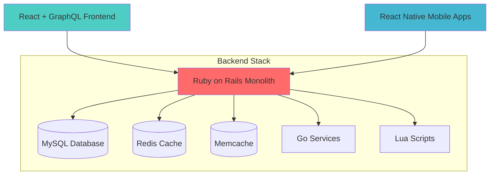
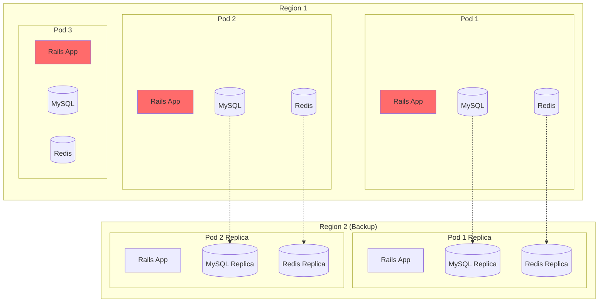
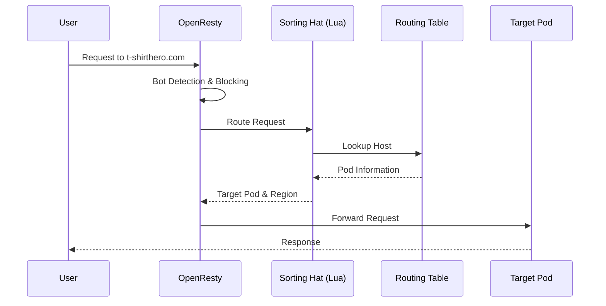
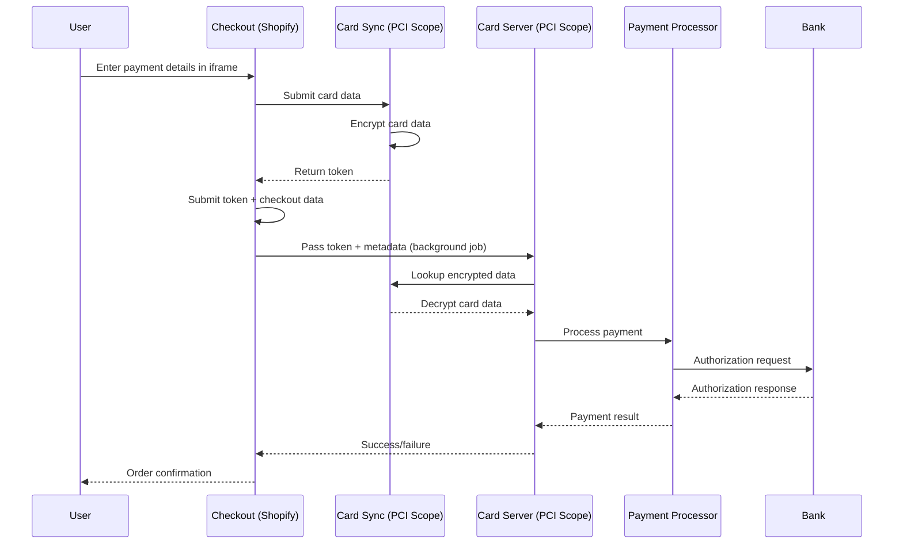
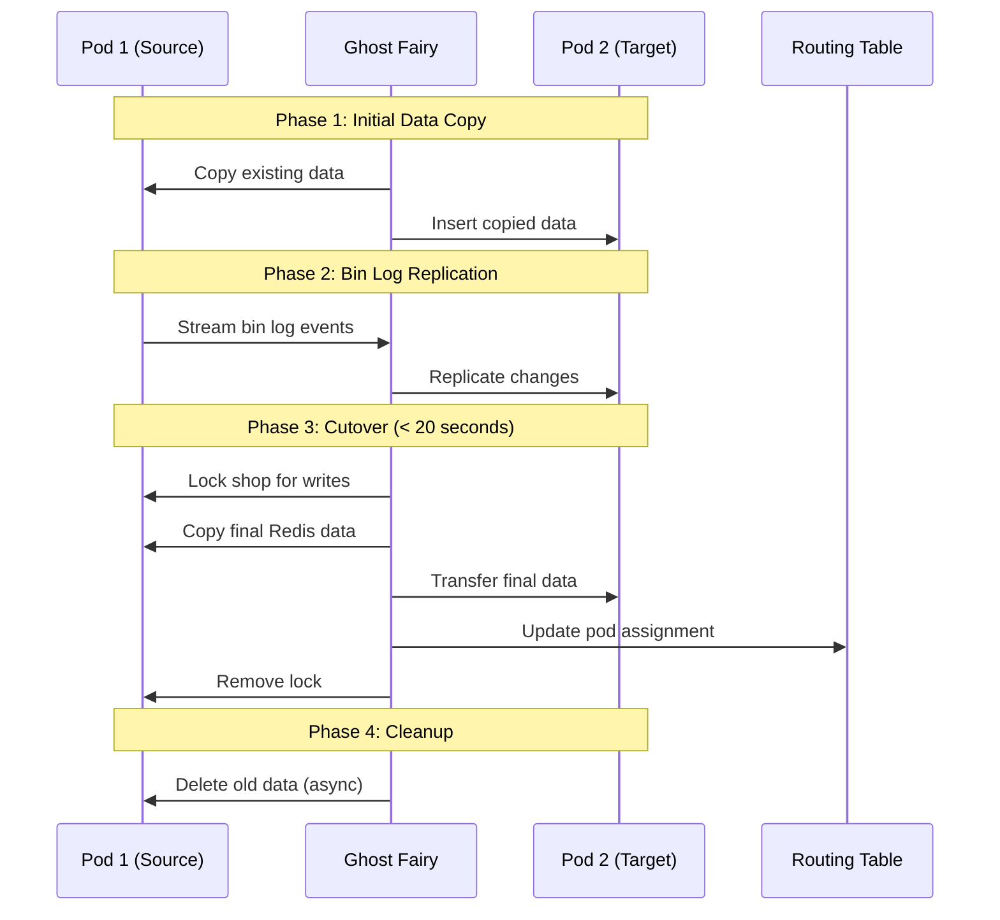
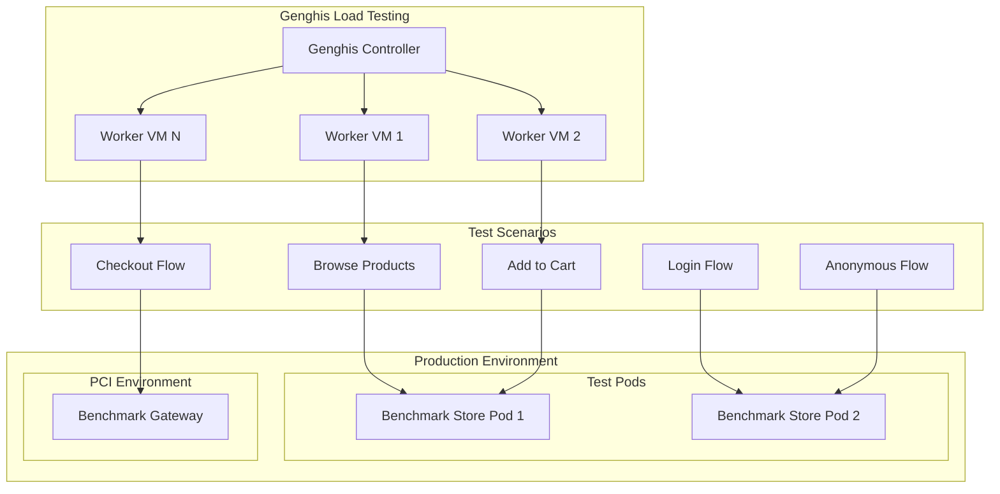
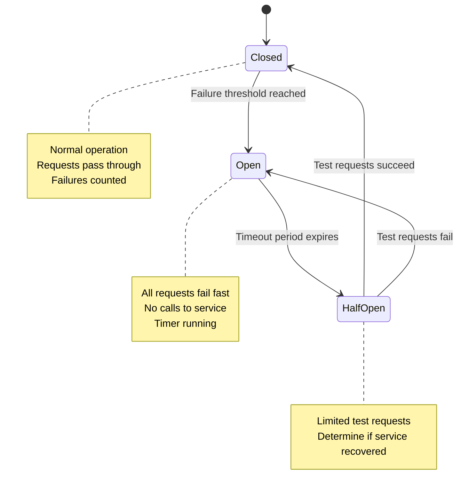
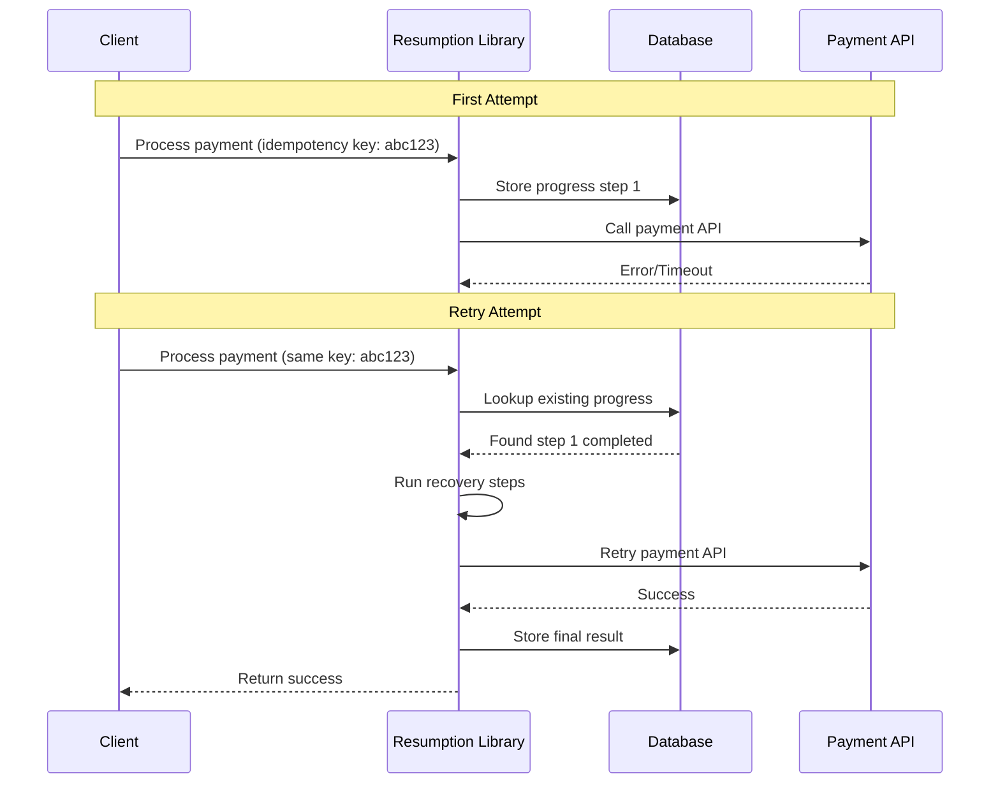

# Shopify's Architecture to Handle the World's Biggest Flash Sales

**Speaker:** Bart de Water  
**Role:** Lead, Insights and Reporting Team, Shopify Payments  
**Location:** Montreal, Canada  
**Twitter:** @btwater

---

## Table of Contents

1. [Introduction and Overview](#introduction-and-overview)
2. [Shopify Platform Overview](#shopify-platform-overview)
3. [Technology Stack](#technology-stack)
4. [Pod Architecture and Request Routing](#pod-architecture-and-request-routing)
5. [Payment Processing and PCI Compliance](#payment-processing-and-pci-compliance)
6. [Scaling for Flash Sales](#scaling-for-flash-sales)
7. [Shop Migration and Rebalancing](#shop-migration-and-rebalancing)
8. [Storefront Architecture Evolution](#storefront-architecture-evolution)
9. [Load Testing Strategy](#load-testing-strategy)
10. [Resiliency and Failure Handling](#resiliency-and-failure-handling)
11. [Circuit Breakers and Error Handling](#circuit-breakers-and-error-handling)
12. [Idempotent Payment Processing](#idempotent-payment-processing)
13. [Results and Performance](#results-and-performance)
14. [Q&A Session](#qa-session)

---

## Introduction and Overview

Welcome to my talk on Shopify's architecture to handle the world's biggest flash sales. My name is Bart de Water, and I lead the insights and Reporting team of Shopify payments. Shopify payments is our built-in Payment Processing solution that we offer to merchants in 17 countries around the world. We also support many payment integrations from third parties. I've been working on various parts of Shopify's payment processing systems for the past five years. I'm originally from the Netherlands and I moved to Montreal Canada for the job back when Shopify was an office-based company. You can find me on Twitter @btwater.

## Shopify Platform Overview

In case you're unfamiliar with what we do at Shopify, our mission is to make Commerce better for everyone, and we do that by offering a multi-channel platform hosting millions of merchants, allowing them to sell wherever their customers are - whether that be via their online storefront, social media, and also in person at brick and mortar or pop-up stores, all with a single integrated back office for merchants to run their business from.

We've gotten really good over the past few years at handling flash sales, and that's why I'm giving this talk. A flash sale is a sale for a limited amount of time, often with limited stock. It's over in a flash because the product can sell out in seconds, even if there are thousands of items in inventory.

You might think that's not new - that sounds like a regular sale. Yeah, you might have seen videos of crowded shopping malls around the holiday periods with customers rushing in as soon as the gates open. But today these flash sales happen any time of the year. The current iteration of flash sales was popularized by digital-first brands with product drops. This is a sale of a limited edition of something - for example, lipstick or a pair of sneakers - and these brands create hype on their social media platforms which then drives enormous amounts of traffic and sales the moment the product is available.

This type of sale poses an interesting engineering challenge. As the amount of merchants that we host grow and they grow their customer base, today's flash sale will be tomorrow's base load.

## Technology Stack

A quick rundown of how we build Shopify: our main tool of choice for building back-end systems is Ruby on Rails with MySQL, Redis, and Memcache as our data stores. We use Go and Lua in a couple of places as well, mostly for performance-critical backend parts, and I'll talk about those later in this talk.

On the front end, we use React with GraphQL APIs, and we use React Native for our mobile apps, including the point of sale that I showed you earlier.

You may have heard that Shopify's main Rails app is a monolith, and we deploy this around 40 times a day as hundreds of developers worldwide are working on it.

This is a familiar sight for folks in the audience, I presume: you are browsing for products, adding to cart, and checking out. And then this is the perspective from our merchant's admin - there's an order ready to be fulfilled.

We just saw three major sections of Shopify, and in this talk I'll mostly focus on storefront and checkout since these two see the most traffic. You'll notice that storefront and checkout also have very different characteristics and requirements. Storefront is mostly about read traffic, while our checkout does most of the writing and has to interact with external systems as well.

## Pod Architecture and Request Routing

Before we continue, I need to introduce a little bit of our terminology. A Shopify pod - not to be confused with a Kubernetes pod - a Shopify pod contains data for one-to-many shops and it's basically a complete version of Shopify that can run anywhere in the world. It is more than just a relational data shard, which is why we use the name "pod".

We have multiple of these pods. These stateful systems are completely separate from each other. The pods run in a single region, and while the data stores are isolated, the stateless workers are shared. This allows us to balance the load in a region where a shop on a certain pod is having a flash sale, and in case something goes wrong with a certain pod - like an overloaded MySQL instance - this does not affect the other pods or the shops that are hosted on there.

We also have multiple regions, and a Shopify pod is active in a single region at a time but exists in two, with replication set up from the active to the non-active region. We can fail over an entire pod to another region if need be, like if some sort of catastrophe happens.

With that context, we can now talk about how a request gets routed to the appropriate pod. Part of request routing involves domains, which involves a little bit of branding. A merchant at signup can choose a domain that we give them for free - a subdomain of myshopify.com - and they cannot change it later. Sometimes they don't like that. You might sign up with "cool-t-shirts" as your brand name first and then later decide that actually you want to be known as "t-shirt-hero". So you can buy or bring to us t-shirthero.com and we'll make sure that everything is taken care of from there on. We'll use this in the rest of our examples.

Once a request for our store t-shirthero.com enters our network, the first thing it runs through is OpenResty. OpenResty is an Nginx distribution that supports Lua scripting. We use these scripting capabilities for many things before it actually hits the Ruby on Rails application layer. Stuff that we do includes blocking bots and routing traffic to the right pod.

Now you might be wondering, what do bots have to do with it? The limited edition merchandise sold in flash sales - like those sneakers - could fetch double or triple the original price on the secondary market. Merchants don't want their products to be sold like that, and bots also hammer our systems much more than real buyers do, so we try to block them. Since the pandemic started impacting supply chain issues, the bot problem has also spread to other products like graphics cards or gaming consoles.

But back to routing traffic: we have a Lua module called "Sorting Hat" that looks up the host in the routing table and finds the corresponding pod that the shop belongs to. The request is then routed to the appropriate region where the pod is active. Our Rails application receives a request and handles it.

As I mentioned before, our Rails application is a monolith. It's probably one of the oldest and biggest Rails apps out there.

Zooming in on the monolith, we see that the checkout component needs to collaborate with a few others in order to get its work done. This is a list of some, but not all, the components we've subdivided the Shopify app into. We have the checkout, line items, any discounts or promotions that are applied, there are taxes involved, shipping lines - maybe you paid more for extra shipping - and all of these add up to a total amount that needs to be charged to our buyer.

## Payment Processing and PCI Compliance

Since my background is in payments, I'll continue pulling that thread a little bit more for the rest of this talk. Shopify supports many different payment processors and payment methods. I'll also use a credit card as an example here since processing credit cards comes with some additional interesting challenges compared to other payment methods.

If you've ever dealt with credit card payments, you've heard about something called PCI compliance. This refers to the Payment Card Industry Data Security Standard. The standard sets out six groups of requirements that need to be adhered to in order to make sure that card information is handled in a secure manner.

Now these all sound reasonable. Let's just implement all of them, get our yearly audit done, and slap a compliance sticker on it - call it a day, right? Easier said than done. Bringing all of Shopify's monolith in scope would be a problem. As I mentioned earlier, we have hundreds of developers shipping the monolith around 40 times a day, and having to meet all of these requirements in the way auditors expect them to would really slow us down.

We also allow merchants to completely customize their shop's look and feel with HTML templates and JavaScript, and we have an ecosystem of apps that can add functionality to stores. So we need to keep all that sensitive card data away from these things.

If you were to right-click "inspect element" on any of these fields, you would actually notice that these are iframes hosted on a completely separate domain from the merchant store and their checkout. And this is how we keep the Shopify monolith out of scope - we just don't let it see any card data in the first place. I'll show you how that works.

When you submit the payment step of the checkout, these iframe fields with the card number, the cardholder name, the CVV, and the expiry date are first submitted to an application we call Card Sync. Card Sync takes this sensitive data, encrypts it, and returns a token back to the checkout JavaScript.

The checkout code then submits this token alongside all the other checkout data to the main Shopify application. At this point, the buyer is presented with a waiting screen with a little spinner that says that their order is being processed.

What actually happens is that a background job in the Shopify monolith passes the token and payment metadata to an app we call Card Server. Card Server uses the token to look up the encrypted data in Card Sync and decrypts it. It then uses this card data and the other metadata sent from the monolith to find the right payment processor to talk to. Using an adapter library, it transforms the standardized call into the processor-specific API call.

From there, the authorization request goes over to the acquiring bank, the card network, and the issuing bank that ultimately decides to authorize or decline the charge. Assuming the charge is authorized, a success response is returned back and the checkout is converted to an order.

This is when the buyer sees the order status page thanking them for their business. There's also a confirmation email sent, any webhooks for apps are fired, and the merchant has their order to fulfill from the admin.

## Scaling for Flash Sales

But this was just a single purchase. How about those big flash sales I mentioned earlier? Black Friday and Cyber Monday - or BFCM as we call it - is our largest event of the year. We have a lot of merchants organizing flash sales during that long weekend at the end of November.

To give you an idea of the scale that we're talking about, here are last year's numbers: $6.3 billion in total sales with requests per minute peaking up to 32 million requests per minute. And every year is larger than the previous one too, as we have more merchants choosing our platform and the merchants' businesses themselves are also growing bigger.

In order to support this growth on all these fronts, we need to circle back a bit and talk more about our pod architecture.

Much like pods don't talk to each other, neither do shops. Every unit of work - be it a request or background job - should operate on only a single shop at a time. This means that we write code that only cares about shops and not the pods that they're on. Since we don't care about these pods in application code, we can actually easily add more of them and horizontally scale out Shopify to support growth of the platform.

But as merchants also grow at their individual pace, we occasionally need to rebalance pods by moving shops around in order to evenly spread load and disk usage. And of course, we need to do this with as little downtime as possible.

What also follows from the tenant isolation principle is that things that do need to work across multiple shops need to be either built in a separate application or use our data warehouse for analysis. An example of such an app is Shop Pay - that's our one-click checkout solution that is an exclusive feature of Shopify Payments that allows you to easily pay for things across multiple Shopify stores.

## Shop Migration and Rebalancing

We'll be moving our example shop to Pod 2 to show the process.

We first start by copying over all data in MySQL - things like products and orders - and we copy over all the rows where the shop ID matches. This covers all the existing data, but in order to make sure we get into complete sync, we also need to take into account new data as it comes in. We do this by replicating the MySQL bin log. The bin log is a stream of events for every row that is modified.

We've open-sourced a library that does this row copying and bin log replication. We call it Ghost Fairy, and it's available on GitHub.

These next few steps will go pretty fast. Once we've done our row copying and bin log replication and we're in near-complete sync, we lock the shop for any writes and queue any writing data. This is also the moment when we start copying over jobs and other things in Redis.

We then update the pod ID in the routing table. Once all of that is complete, we remove the lock and we can now serve requests from Pod 2.

I mentioned that this was pretty fast. We can do this for a lot of stores in less than 10 seconds of downtime, and even for our larger stores, we can do it in less than 20 seconds.

You may have noticed that Pod 1 still contains the old data for our store t-shirthero. It is deleted asynchronously in order to reclaim the space.

## Storefront Architecture Evolution

Bringing me back to the three sections we saw at the start: we had storefront, checkout, and admin. One of these is not like the others. Storefront has a very different kind of traffic pattern and it's also aiming to provide a different sort of guarantee. It also sees much more traffic. Unfortunately for our merchants, not every window shopper becomes a paying customer.

Over the past couple of years, we have actually rewritten our storefront rendering code in a separate Ruby application from scratch, and we run it separately from the original monolith. While doing so, we had to make sure that we wouldn't break any of the existing merchant templates, which are written in a language we call Liquid.

Again, OpenResty and Lua scripts were used to make the process seamless for our merchants and their buyers. First, we ran the new rendering app in a shadow configuration to verify the HTML was equivalent before we started moving production traffic over. Having this flexibility in scripting also allowed us to quickly revert back to rendering from the monolith in case of any regressions.

Eventually, this new implementation became the standard one, and it's much faster. We can also independently scale it from other parts of Shopify.

The next step in scaling this would just be to never render any HTML at all - let the client do it and unlock infinite scale. Okay, we need to render the API responses still, so it's not that easy. But over the past five-plus years, we've seen a rise in headless commerce where our technically savvy merchants want to actually completely develop their own front end. Often these are single-page applications using frameworks like React, and we support that too. We're building a React-based framework called Hydrogen which can optionally be hosted on Shopify's network using Oxygen.

## Load Testing Strategy

Now that we've talked a little bit about our architectural approach, how do we make sure it all works in practice? One way we do that is by load testing, and when we do that in production.

We have a tool for this that we developed called Genghis. Genghis is a load generator that spins up a lot of worker VMs that then execute Lua scripts, and these Lua scripts describe certain steps of behavior that we see. We don't want to just hit the storefront a million times with GET requests because that will only tell us how well the caching works. These Lua tests can be combined to describe end-to-end flows like browsing, adding to cart, checking out, and anything else we would see in real life.

It's not a singular flow that we just unleash. For example, we have different flows describing logged-in and anonymous customers since these two hit different code paths and caches. We want to test them separately and make sure all the edge cases are hit.

So when we set up load testing, remember that Shopify has a sharded multi-tenant architecture. We run Genghis against specifically set up benchmark stores in our production environment. Every pod has at least one in order to realistically load test.

We also need to stress our PCI environment, but most payment processors would rather not be on the receiving end of these load tests. So instead, we have set these stores up with a simple benchmark gateway - also a Go app - and the benchmark gateway can respond with both successful and failed payments with a realistic distribution of response times and latencies that we see in production.

We run these tests at least weekly. We want to make sure we find out about bottlenecks first and not through a major merchant's flash sale.

All these major pieces of infrastructure have their service level objectives set in an application called ServicesDB, and if during the weekly load tests SLOs are not met, the owners are notified and requested to prioritize a fix. We consider being fast an important feature.

## Resiliency and Failure Handling

But at our scale, it is inevitable that something will go wrong, so we plan for that. We need to understand our dependencies, their failure modes, and how these impact the end user experience. We do this by creating what we call a Resiliency Matrix.

Using this matrix, we can develop a plan to run a game day and simulate an outage. During these game days, we look to see if our alerts and automations trigger as expected and if our developers have the knowledge and process in place to properly respond.

(And for the people who are paying close attention to this slide, "Shipify" is not a typo - it's the name of our application that provides shipping services such as purchasing shipping labels.)

## Circuit Breakers and Error Handling

One pattern we apply throughout applications to respond to failures is the circuit breaker. Like the circuit breaker pictured, once the circuit is opened or tripped, no current flows through. We use it to protect data stores and APIs, both internal and external APIs.

Over time, a circuit breaker looks a little like this: we are talking to a service and we're hitting timeouts a few times in a row. Knowing that an external service that goes down tends to stay down for a while, once the circuit breaker is tripped, we raise exceptions instantly and we don't wait for another timeout to happen.

These instantly-raising exceptions can be rescued and in some cases used to provide alternatives. A degraded service is better than being completely down. For example, if Redis is storing our user sessions and it goes down, we could present a logged-out view instead, so that potential customers could still browse their storefront instead of getting an HTTP 500 error.

Circuit breakers are also an obvious place to put alerting and monitoring around. In order to know when resources are back up again, after a certain amount of time we do need to allow a couple of requests through in the half-open state. If these requests are successful, the circuit resets to its closed state. If not, the circuit breaker stays open and keeps raising errors for the next little while.

Shopify developed its own library called Semian, which implements circuit breakers for Ruby's HTTP client as well as clients to connect to Redis, MySQL, and gRPC.

You might be wondering how you're going to test this failure in your unit tests. For this, we have an app called Toxiproxy. It's a proxy written in Go that not only allows us to simulate a service going down but also inject other kinds of failures from our test suite. We can reliably trigger these failures in Toxiproxy and prevent accidental regressions.

For example, in these test cases, we make sure that the "user gets session" call doesn't error out if Redis is down.

One interesting aspect to consider is: what do we scope our circuit breaker to? Some services can be partially down with a subset of requests failing while most of them are fine.

A reasonable default from the Semian readme pictured here is keying the circuit breaker identifier off of the API endpoint. The Semian configuration lambda is called on every HTTP request with the host and port arguments forwarded, and we concatenate these together to create the identifier for the circuit breaker to check.

Most of the time this is fine. We don't want to know more about how the other side works because we don't want to tightly couple ourselves to an implementation on the other side. But there are a couple of cases where it might make sense to deviate from this.

Payments, for example, have a sort of country dimension to them. Of course there's regulation, but also acquiring is done at a local level for lower costs and better authorization rates. So even if you call the same host API worldwide, behind the scenes it actually takes a country-specific path.

By adding the country to the circuit breaker identifier, if there's some sort of upstream outage that prevents payments from being processed for Canadian merchants, we don't want the open circuit to affect American or Mexican merchants and block their payments from going through.

Another example here could be a shipping label aggregator. It might make sense to incorporate the name of the carrier instead of a country name.

## Idempotent Payment Processing

In case of failures, we'd like to retry before giving up completely. But the side effects of retrying a call like the one pictured here could end up costing someone money. That's not just something that quickly drains the trust of merchant customers, but if these double charges are not corrected after the fact, this could also end up with the cardholder opening disputes with their bank to get their money back. This process would in turn end up costing the merchant time and money in dispute fees as well.

In short, for processing payments, we want exactly-once semantics when we send this type of request, and we can do that by including an idempotency key in the request that uniquely identifies this payment attempt.

At Shopify, we've written a library called Resumption to make it easier to write idempotent actions. For the Ruby developers in this audience, we're looking into open-sourcing this.

We define an action class that contains multiple steps, and each step of progress made is recorded in the database. Each step describes the action it takes and how an idempotent call can recover any state before continuing if it's a retry call.

In this example, we have the same idempotency key shown in the earlier example, but unfortunately when we want to actually call out to our processor, an error is raised. When our client retries the request with the same idempotency key, we first look up the progress stored in the database. We find it, and then we run through the recovery steps first before trying to call the remote API again. This time it succeeds, and we handle the remote response.

## Results and Performance

Given we're coming up near the end of my presentation, this graph visualizes how everything I just talked about culminated over the course of the year. We scaled up our systems, prepared our resiliency matrices, ran our load tests and game days, and our merchants had another successful Black Friday Cyber Monday weekend.

You'll notice in this graph two types of load tests were run last year. The architecture tests focused on testing the new components introduced - like the storefront renderer and changes to our MySQL infrastructure - and we ran these tests early to make sure that any gotchas were caught early and that we had time to address them.

Later in the year, the scale tests were the more traditional load tests for which we scaled up to 2021 levels and made sure we were ready for the actual BFCM event.

## Recap

Here's a quick recap of what we've covered today:

- We started with how a request gets routed to the right Shopify pod and how we can pay for a checkout with a credit card without exposing the card details and the PCI compliance requirements to the main Shopify monolith
- Then we talked about scaling up for Black Friday Cyber Monday by adding new pods, moving shops around, and extracting storefront rendering from the Rails monolith
- Finally, we talked about doing load testing in production and our strategies for handling anticipated failures gracefully using circuit breakers, Toxiproxy, and idempotent payment APIs

Thanks for attending my talk. I hope you found it interesting. A lot of these subjects are also covered on our engineering blog, which you can find at shopify.engineering. In case you have any questions, you can find me on twitter.com @btwater.

---

## Q&A Session

### Moderator Introduction
Thank you for joining us, and it's really a really interesting presentation. Before jumping on the questions for the audience, just to warm up and let people have time to start, I'll just ask you: I guess that some special customers that have a high load and really big stores - they receive special treatment on Shopify infrastructure, is that correct?

**Bart:** As I would say with any multi-tenant system, there's always that handful or maybe a few dozen tenants that are 10-20 times bigger than the next set of customers. Given that we have a sharded or a podded architecture, some of these extra-large merchants do have an entire pod for themselves, yes. In other cases where we have just regular big merchants, we have other systems in place to make sure that when they do a flash sale, they don't monopolize all the capacity and that smaller merchants who are co-located on that pod also have a chance to conduct their business.

### Question 1: Testing for Flash Sales and Hot Spots
**Moderator:** That would be my follow-up question: how do you test this to prepare for flash sales to avoid one big hot spot shooting down tons of small merchants?

**Bart:** So this is a continuous process. Once a merchant signs up, they're assigned round-robin to an available pod, and then it might just happen to be that that one particular merchant is going to be one of these extra-large flash sellers. That's why we have the shop mover, so we can adjust as we see how merchants are behaving, how they're growing on their pods, and then rebalance as needed.

### Question 2: Pods as Pets vs Cattle
**Question from Satish:** I imagine that pods are very large. How do you run ownership of the pets?

**Bart:** I'm going to assume here you mean "pets" as in pets versus cattle - cattle being completely automated rollouts of things and pets being named servers that you babysit and are typically hand-built and set up. No, so pods in that regard are cattle. It's just the fact that we can - it's a way to kind of reason about the fact like where is this merchant? Is this merchant on pod number nine? Then yes, that is a complete set of Shopify that runs in isolation, but we can set up new pods very easily and even recreate them if need be.

For example, when we have to do Kubernetes upgrades, we can run an entire pod in a single data center, upgrade the passive data center, or even just completely rebuild it over there and then move everything back. It is definitely not pets.

### Question 3: Temporal vs Resumption
**Question from Emerson:** Just curious if you looked into Temporal before building Resumption, and if so, how does it compare?

**Bart:** We did not. If you look at Shopify's background job system history, Toby our CEO was a Rails core member back in the day. He built delayed job where we insert jobs in the database and a separate process pops them off a queue, works them, and updates the database again. Well, as you can imagine, at some point MySQL is just not meant for all that writing and updating of jobs in high-throughput scenarios.

Then GitHub came along with Resque, which was Redis-based, and for the monolith we're now running a heavily customized version of Resque - it's basically something new at this point. I only heard about Temporal quite recently, so Shopify's background job system has evolved in its own way over the years.

### Question 4: Pod Size Limits
**Question from Satish:** How do you determine what is the limit on pod size?

**Bart:** Yeah, so that's with load testing. There were two types of load tests that we did - we have the regular load tests where we're more concerned with the correctness of all the protection layers working, and then there's also the scale tests. Those are the ones where it's just like "let's try and break it" - let's just keep throwing more and more checkouts at it until we find the limit and then figure out: is this a limit that we expected there to be? Is it something that we could solve? Or given that Black Friday is in two weeks from now, we're just going to assume this is the limit, and since it's good enough, we don't want to introduce last-minute changes for stability.

### Question 5: Breaking Up the Monolith
**Question from Hang:** Is this monolith something that's going to be broken into microservices?

**Bart:** Not anytime soon. There is a blog post on our engineering blog called "Deconstructing the Monolith" which goes into our efforts to componentize these various parts of Shopify. The way that we're thinking about it right now is that things that pertain to a single shop - like an order or a chargeback or a refund - it's just easier to keep it in a monolith.

But we do want to make sure that we don't accidentally evolve into a big pile of spaghetti. So we built a system that can enforce these component boundaries and create API boundaries like you would have with microservices, but instead we're not going over the network to make these calls. This way we're looking to combine the best of both worlds: no latency, no extra complicated debugging with logs from extra systems, but still have some of the isolation principles.

### Question 6: Rebalancing Downtime
**Question from Shivam:** How does the rebalancing work? Can it be done without downtime?

**Bart:** It was part of my presentation - very little downtime during the cutover phase where data is in sync at 99.999% sync, where we do have to say at the old pod, "Okay, we need to stop creating data here, otherwise we're never going to be done," and then update our routing layer to now point it to the new pod.

### Question 7: Pod Architecture Rationale
**Moderator:** What was your rationale or your team's rationale behind choosing a pod-based architecture, and what challenges didn't you foresee?

**Bart:** Well, I have to say that this was before my time. I believe Shopify outgrew a single database around 2010-2012, I think it was. Basically, you know, sharding is kind of the logical step in case you cannot just throw more money or bigger hardware at the problem, and that's how it continued to evolve. Going for a rewrite around that time, I imagine that Shopify was already too big and new features needed to be shipped at a pace that made a rewrite just not tenable.

### Question 8: Cross-Pod Analytics
**Moderator:** How do you aggregate data from all the pods to generate analytics?

**Bart:** That happens in - so all of the pods' data are fed from a read replica into our data warehouse. I think it's Presto that we use under the hood there. Basically, our data scientists or even myself, in case I am curious about something, I'll need to go to the data warehouse to aggregate across all of our data.

### Question 9: Current Team Challenges
**Moderator:** What is the problem or challenge that you're working on right now in your team?

**Bart:** Right now I am looking to make things go even faster than they already are going today. There's a couple of initiatives that I'm looking into with our financial partners to optimize our request patterns to see that we can make individual payment requests go faster, and then therefore defer some of the work to be after the payment has been done. That way, make the critical moments - which is transaction time - faster for them and for us, and then therefore also for our buyers because they are not waiting at that spinner for three seconds but maybe two seconds. So it's good for all involved.

### Question 10: Storefront and Checkout Scaling
**Question:** Can you elaborate on the scaling story from storefront to checkout? I assume all the systems - storefront and checkout - are part of the monolith?

**Bart:** So that kind of hooks into the multi-repo or monorepo question as well. Storefront - the new storefront renderer system that was built - that is now completely separate from the monolith. But it's a very recent part of our evolution that only happened in the last two years or so. That project kicked off and is now fully shipped recently.

So yeah, that means that for over 10 years, we've scaled up monolithically very well. Checkout is still part of the monolith because it is tied to so many other systems. You know, storefront is - if you reduce it to its most simplest form - almost all read-only, very heavy cacheable traffic.

Checkout, however, needs to write to a lot of things in the database. It needs to store the fact that the payment happened, from the checkout create an order object, create shipping orders, the balance that needs to be paid out to the merchant needs to be updated. Checkout is in so many places in that regard that building that into a completely separate service - it would be possible because nothing is impossible if you just have enough time and willingness - but that would be such a monumental undertaking. You're basically rewriting Shopify at that point. I don't see that happening anytime soon.

### Question 11: Storefront-Checkout Communication
**Follow-up:** How does the storefront talk with the checkout?

**Bart:** It doesn't - that's kind of the beauty of it. What happens is that you have a cart, right, in which you're placing the products, and the moment that you start entering information like your email address or your shipping address, that's when we start calling it a checkout instead of just a cart because there's the intent to pay at some point at the end of this. Other than that, it's very decoupled, and literally the cart is purely client-side until you actually start storing some buyer information.

### Question 12: Enforcing Component Boundaries
**Moderator:** Coming back to the topic of component boundaries between teams - how do you enforce this? Do you have some features or functions to keep your architecture so that the code doesn't become spaghetti? Because the tendency of people is when they are under pressure, they usually take shortcuts. So how do you enforce this, and do you enforce this automatically or not?

**Bart:** Yes, and we do use that automatically. I will share it in the chat - it is an open-source library called Packwerk.

Using static analysis, this allows us to analyze "hey, is something in the payment processing component talking to something in the order component, but it's directly using the order object without going through the order public API to update the amount?" You can imagine with an order, there's a lot of state on it, right? There is the amount before discounts, the amount before taxes, the amount before discounts and taxes, and if I from my payments component just start updating one little number, their internal consistency is all messed up and it's going to lead to a lot of pain for everybody involved - and especially the order team.

I'm using them as an example because they are sort of intertwined into almost everything else. They're the ones that have traditionally felt the most pain there, so they were the ones that were very eager to adopt these new practices and make sure that there would be no way anymore for people to internally mutate that state, either intentionally or by accident.

As you can imagine, initially we just started logging warnings, and eventually these warnings are added to a list - "okay, we know that everything on this list is bad, but if you introduce a new thing that is not yet on that list, then it breaks the build." Which means that the PR needs to now make a call: "Am I going to add to that list?" - which is not great, but sometimes for reasons of emergency, you sometimes just need to add a little bit more badness before you can make it good again.

In other cases, it's just "no, sorry, go back, redo your PR." Your use case does not warrant making it worse than it is. Boy Scout rule: make it better. Typically at Shopify, we're all trying to make this system better, so usually if you don't know how to do it or maybe you're missing an internal API or not sure which one to use, you hit up the order team and say "hey, so the build broke, I understand this was not how it's supposed to be, but can you help me figure out how I am supposed to do it then?"

But yeah, it's one of these things where the answer in short is: it depends. But usually this type of problem behaves in that way.

### Question 13: Future of Ruby at Scale
**Moderator:** Shopify is well known for being one of the highest-scale Ruby use cases in the world. How do you feel about the future of the language and the platform and ecosystem?

**Bart:** So Shopify employs people who work on Ruby and on Rails itself. Recent in Ruby 3.0, there is an experimental just-in-time compiler called YJIT (Yet Another Just In Time compiler). Where earlier efforts in Ruby to build just-in-time compilation have shown effectiveness in benchmarks, the elusive thing was to see an actual speedup in Rails applications or web apps in general.

Since this team was working at Shopify, of course their mission was to make a JIT that would actually also speed up Rails use cases. So in Ruby 3.0, it ships as an experimental feature, and I think it was somewhere around 20% speedup in an average Rails app.

They are for Ruby 3.1, which is due to be released this Christmas, they've decided to rewrite it in Rust because they figured it's going to be easier to maintain in Rust than it is in C. While they are rewriting YJIT in Rust, they've also seized a few opportunities to make some small improvements along the way as well.

This is something that we are looking forward to for the ecosystem, especially because there's a lot of investment from Shopify in this effort. You can imagine at our scale, running so many application servers and many applications, a 20% increase for us is very sizable as well. That means we have to scale up fewer servers for the next Black Friday.

Our monolith runs very recent development versions of Ruby and of Rails, so typically when something changes in Rails, we're among the first to catch any regressions, either in performance or compatibility. So we can then fix that and contribute that back. By the time that version actually is released in a stable version, it's basically been tested for at least a year at Shopify already, and we also then spend time upgrading gems or whatever that needs fixing.

### Question 14: Go Code Organization
**Question from Ryan:** Do you use anything similar to Packwerk for your Go code as well to avoid the dependency spaghetti?

**Bart:** That's a good question. I'll have to admit that my work doesn't involve a lot of writing Go. I don't believe we have something like Packwerk in Go because we don't have a very big app like our monolith in Go at all. Go is mostly used for very specific pieces of our infrastructure, less so on the merchant or buyer-facing things, and they tend to be small, very focused apps - nothing big and monolithic.

I think also - and here's where I'm going to be very honest, I don't know Go that well - I think also Go's packaging system by default is more strict than what a typical Rails app would prescribe you.

---

**Moderator:** Bart, thank you so much for your time. This is a great presentation with a lot of insights for me here. I invite everyone to hang out more with Bart in the hangout room, so see you there and thank you again.

**Bart:** Thanks! This was a lot of fun. Hoping to see you all there. See you, bye!

---

*This transcript has been formatted and organized for better readability while preserving all the original content and technical details from Bart de Water's presentation on Shopify's architecture.*