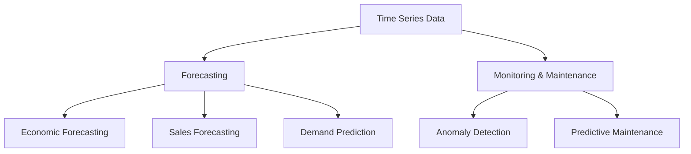
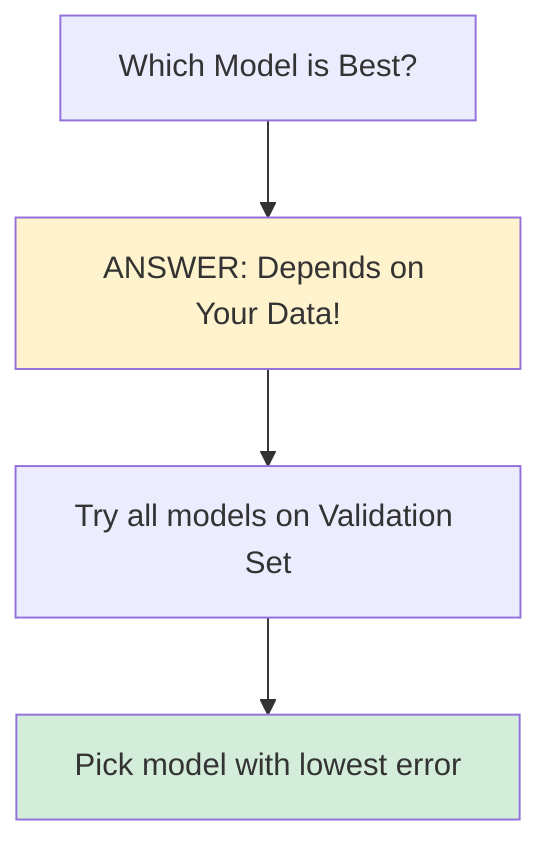
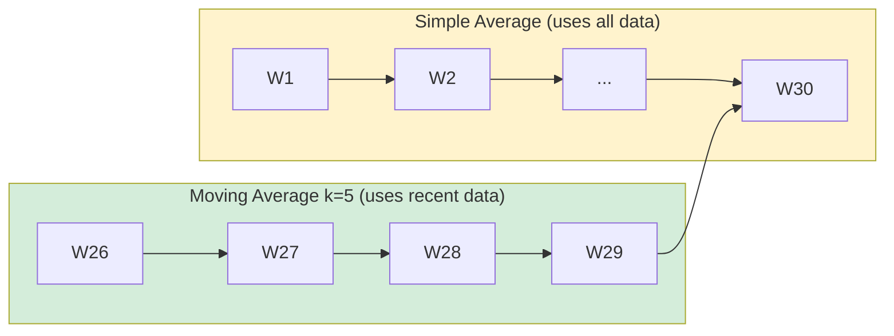
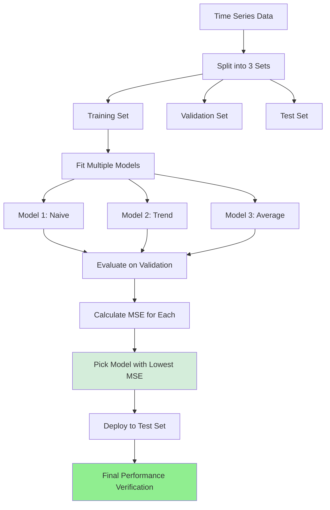
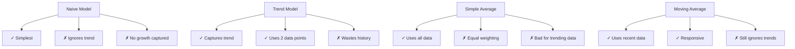

# Time Series Modeling & RNNs - Lecture Notes

**Date:** February 8, 2026  
**Language:** English  
**Model:** Whisper Medium  
**Session ID:** session_78257ce2_20260208_090534

---

## Table of Contents
1. [Introduction to Time Series](#introduction-to-time-series)
2. [Types and Examples](#types-and-examples)
3. [Applications](#applications)
4. [Forecasting Models](#forecasting-models)
5. [Model Evaluation](#model-evaluation)
6. [Advanced Topics](#advanced-topics)

---

## Introduction to Time Series

**Timestamp: 09:05:52 - 09:08:24**

### Definition

A **time series** is an **ordered sequence of values of a variable measured at equally spaced time intervals**.

**Key Components:**
- **Ordered**: Values follow a time sequence (e.g., 1921 → 1931 → 1941)
- **Variable**: The metric being measured (e.g., salary, temperature, stock price)
- **Equally spaced**: Consistent time intervals between measurements

**Example:**
```
Year: 1921 → 1931 → 1941 → 1951 → 1961 → 1971
Population (millions): 200 → 250 → 300 → 350 → 400 → 450
Time interval: 10 years (equally spaced)
```

### Types of Time Series

| Type | Characteristic | Example |
|------|-----------------|---------|
| **Regular Time Series** | Equal spacing between data points | Daily stock prices, monthly sales |
| **Irregular Time Series** | Unequal spacing (faulty measurement or random events) | Temperature from broken thermometer, shop entry times |

> **Business Importance**: Regular time series are most commonly used in business applications.

**Why Irregular Time Series Occur:**
- Faulty sensors or equipment
- Random events (customer arrivals)
- Data collection issues
- Missing measurements

---

## Types and Examples

**Timestamp: 09:06:09 - 09:07:50**

### Common Time Series in Real World

#### 1. **Financial Time Series**
- Stock market indices: BSE, NSE, NASDAQ
- Stock prices and trading volumes
- Currency exchange rates
- Used for: Trading, investment decisions, market analysis

#### 2. **Weather-Based Time Series**
- Temperature readings (hourly, daily, monthly)
- Precipitation amounts
- Global land-ocean temperature
- Wind speed and direction

#### 3. **Business Time Series**
- Sales data (daily, weekly, monthly)
- Inventory levels
- Employee salary progression
- Customer traffic

#### 4. **Population & Census Data**
- Population counts
- Census measurements
- Measured every 10 years (decade granularity)

### Granularity Levels

**Granularity** = Time spacing between measurements

```
Daily:     Monday → Tuesday → Wednesday → Thursday → Friday
           (Used for: Milk packet sales, daily transactions)

Yearly:    2020 → 2021 → 2022 → 2023
           (Used for: GDP, annual revenue)

Decadal:   1961 → 1971 → 1981 → 1991 → 2001
           (Used for: Census, population studies)
```

---

## Applications

**Timestamp: 09:09:30 - 09:12:14**

### Two Main Use Cases



### 1. **Forecasting** (Primary Focus of This Lecture)

**Definition**: Use past observations to predict future values

**Real-World Applications:**

| Domain | Example | Impact |
|--------|---------|--------|
| **Economics** | GDP, inflation rates | Policy decisions |
| **Sales** | Next month's sales, Diwali demand | Inventory planning |
| **Supply Chain** | Demand, supply, inventory levels | Stock management |
| **Agriculture** | Crop yield projections | Farm planning |
| **Retail** | Customer demand patterns | Stock replenishment |

**Why It Matters:**
- Help businesses plan better
- Reduce waste and costs
- Improve decision-making
- Enable efficient resource allocation

### 2. **Monitoring & Predictive Maintenance**

**Real Example**: Medical Refrigerator Failure Prediction
- Medical refrigerators store transplantable organs (critical)
- Multiple sensors track temperature, humidity, vibration
- Early warning system for failures prevents organ loss
- Combines anomaly detection + time series analysis

---

## Forecasting Models

**Timestamp: 09:13:57 - 09:27:02**

### Historical Context

> Time series analysis has been studied for **over 4 decades** - even before modern machine learning emerged. It's a classical statistical discipline.

### Model Progression Strategy

```
Simple Statistical Models 
    ↓
More Complex Models 
    ↓
Deep Learning (RNNs, Transformers)
```

We'll start simple and gradually increase complexity.

---

### Model 1: Naive Forecast (No Change Model)

**Timestamp: 09:14:35 - 09:15:33**

**Formula:**
$$\hat{y}_{t+1} = y_t$$

**Interpretation**: The next value will be exactly the same as the current value

**Example:**
```
Current Salary: ₹1,000,000
Predicted Next Year: ₹1,000,000 (No hike)
```

**Pros:**
- Extremely simple
- Works when data is stable with no trend

**Cons:**
- ❌ Ignores inflation
- ❌ Ignores growth trends
- ❌ Unrealistic for salary/stock data
- ❌ Nobody likes "no hike"!

**When to Use:**
- Very stable measurements (e.g., room temperature in controlled environment)
- Short-term predictions where trend is negligible

---

### Model 2 & 3: Trend-Based Models

**Timestamp: 09:15:33 - 09:19:56**

#### **Understanding Trend Intuitively**

When asked about salary growth, people typically say:
- "I got a **₹5 lakh hike**" (Additive: absolute increase)
- "I got a **10% raise**" (Multiplicative: percentage increase)

Both are ways of thinking about **trend** = How much the value is changing.

#### **Model 2A: Additive Trend**

**Formula:**

$$\hat{y}_{t+1} = y_t + \left(y_t - y_{t-1}\right)$$

Or equivalently:

$$\hat{y}_{t+1} = y_t + \Delta y_t$$

**Where:**
- $y_t$ = Current value (current year salary)
- $y_{t-1}$ = Previous value (previous year salary)
- $(y_t - y_{t-1})$ = Change/hike from last period

**Example:**
```
Previous Year (y_{t-1}):  ₹1,000,000
Current Year (y_t):       ₹1,100,000
Change (Hike):            ₹100,000
Predicted Next Year:      ₹1,100,000 + ₹100,000 = ₹1,200,000
```

**Use Case**: When change is consistent in absolute value

#### **Model 2B: Multiplicative Trend**

**Formula:**
$$\hat{y}_{t+1} = y_t \times \frac{y_t}{y_{t-1}}$$

**Interpretation**: Multiply current value by the growth ratio

**Example:**
```
Previous Year (y_{t-1}):  ₹1,000,000
Current Year (y_t):       ₹1,100,000
Growth Ratio:             1,100,000 ÷ 1,000,000 = 1.10 (10% growth)
Predicted Next Year:      ₹1,100,000 × 1.10 = ₹1,210,000
```

**Use Case**: When change is percentage-based (more realistic for most growing entities)

---

### Model Comparison So Far

**Timestamp: 09:20:16 - 09:20:54**



**Key Insight**: There's **no universally best model**. You must test empirically.

---

### Model 4: Simple Average

**Timestamp: 09:23:04 - 09:25:44**

**Formula:**
$$\hat{y}_{t+1} = \frac{1}{n} \sum_{i=1}^{n} y_i$$

**Interpretation**: Average all historical values equally

**Example (10-year salary history):**
```
Years 1-10 salaries: ₹50L, ₹55L, ₹60L, ₹65L, ₹70L, ₹75L, ₹80L, ₹85L, ₹90L, ₹100L
Average: (50+55+60+65+70+75+80+85+90+100)/10 = ₹77L
Prediction for Year 11: ₹77L
```

**Pros:**
- Uses entire historical data (doesn't waste data!)
- Captures overall central tendency

**Cons:**
- ❌ Doesn't account for inflation
- ❌ Gives equal weight to old (year 1) and recent (year 10) data
- ❌ Ignores trends
- ❌ Unrealistic for salary in high-inflation environment

> **Why it fails for salary:** Your salary from 10 years ago was maybe ½ or ¼ of current salary. Averaging them pulls prediction down unrealistically.

**When to Use:**
- Stable environmental measurements (room temperature from past 10 minutes)
- Data without significant trends
- Short-term, stable scenarios

---

### Incremental Update Formula (for Efficiency)

**Timestamp: 09:27:02 - 09:28:53**

**Problem**: If you have 1 million data points, recalculating average each time is expensive.

**Solution**: Incremental update formula

**Formula:**
$$\hat{y}_{t+2} = \frac{t \times \hat{y}_{t+1} + y_{t+1}}{t+1}$$

**How It Works:**
1. Don't recalculate the entire average
2. Reuse the previously calculated sum: $t \times \hat{y}_{t+1}$
3. Add new actual value: $y_{t+1}$
4. Divide by new count: $t+1$

**Benefit**: O(1) time complexity instead of O(n)

---

### Model 5: Moving Average

**Timestamp: 09:35:17 - 09:36:49**

**Formula:**
$$\hat{y}_{t+1} = \frac{1}{k} \sum_{i=t-k+1}^{t} y_i$$

**Interpretation**: Average only the **k most recent values** (sliding window)

**Example (k=5 week moving average):**
```
Week:              26    27    28    29    30    31(prediction)
Purchases:         100   110   105   115   120   ?

To predict Week 31:
Take last 5 values: (100 + 110 + 105 + 115 + 120) / 5 = 110

Prediction: 110 purchases in Week 31
```

**Comparison with Simple Average:**
```
Simple Average (k=30):
  Uses all 30 weeks equally
  Influenced by weeks 1-25 
  
Moving Average (k=5):
  Uses only last 5 weeks
  Weights recent data more heavily
  Responds faster to changes
```

**Visual Representation:**



**How to Choose k:**
- **Smaller k** (k=3): Responsive to changes, noisy
- **Larger k** (k=20): Smooth trends, lags changes
- **Solution**: Test on validation set, pick k with best performance

**Practical Example: 30-Week Purchase Data**

**Timestamp: 09:37:12 - 09:39:11**

Suppose you have 30 weeks of purchase data:

```
Week:       1    2    3  ...  28   29   30   31 (predict)
Purchases: 285  290  275 ... 300  310  320   ?
```

**Step 1: Try Moving Average with k=5**

For week 31, take the last 5 weeks (weeks 26-30):
```
Week 26: ~280
Week 27: ~295
Week 28: ~300
Week 29: ~310
Week 30: 320

Moving Average = (280 + 295 + 300 + 310 + 320) / 5 = 289.8 purchases
```

**Calculation Breakdown:**
- Simply add the 5 most recent purchase values
- Divide by 5 (or k in general)
- Result: 289.8 is your forecast for week 31

**Understanding the Residual:**
- Actual purchase in week 31: 268
- Predicted: 289.8
- Residual: 268 - 289.8 = -21.8
- This negative residual tells you the model overestimated

**Step 2: Test Different Values of k**

Try multiple k values on your validation data:
```
k=3:  Prediction with last 3 weeks   → MSE = X
k=4:  Prediction with last 4 weeks   → MSE = Y
k=5:  Prediction with last 5 weeks   → MSE = 289.8 ✓ (lowest)
k=6:  Prediction with last 6 weeks   → MSE = Z
k=10: Prediction with last 10 weeks  → MSE = W
```

**Step 3: Pick the k with Lowest Error**

Calculate MSE for each k:
1. Make prediction for each time point using that k
2. Calculate squared error: $(y_t - \hat{y}_t)^2$ for each point
3. Average all squared errors → MSE
4. **Pick the k with the lowest MSE**

**Why Testing is Essential:**
- Different data patterns favor different k values
- Too small k (k=2) → overfits to noise, jumpy predictions
- Too large k (k=20) → misses recent changes, slow to adapt
- Optimal k balances responsiveness with stability
- **Example**: If k=5 gives MSE=2500 but k=3 gives MSE=2800, use k=5

**Limitations:**
- ❌ Doesn't capture trends (all values averaged equally with equal weight)
- ❌ Doesn't capture seasonality (repeating patterns)
- ❌ Gives **zero weight** to data older than k periods (unlike exponential smoothing)
- ✓ Better than simple average for recent-focused predictions
- ✓ Practical for data that fluctuates around a stable level
- ✓ Easy to understand and implement

**Key Insight from Lecture:**
> "Moving Average doesn't handle trend. If I'm just taking an average, I am not capturing that hike business at all. It just cares about the latest few values, the latest k values, and that's about it."

---

### Model 6: Exponential Smoothing (Single Exponential Smoothing)

**Timestamp: 09:41:41 - 10:01:43**

#### **Why Exponential Smoothing?**

Moving average has a limitation: it gives **equal weight** to all recent observations and **zero weight** to older ones.

**Problem**: What if older data is still somewhat important, but you want to emphasize recent observations more?

**Solution**: Use exponential smoothing with **exponentially decreasing weights**:
- Recent observations → High weight
- Older observations → Lower weight (decreasing exponentially)
- Very old observations → Almost zero weight

#### **The Exponential Smoothing Formula**

**Recurrence Relation:**
$$S_t = \alpha y_t + (1 - \alpha) S\_{t-1}$$

**Where:**
- $S_t$ = Smoothed value (forecast) at time $t$
- $y_t$ = Actual observation at time $t$
- $\alpha$ = Smoothing parameter (0 ≤ α ≤ 1)
- $(1-\alpha)$ = Weight on previous smoothed value
- **Base Case**: $S_1 = y_1$ (first smoothed value equals first observation)

**Interpretation:**
- $\alpha$ controls how much weight goes to the current observation
- $(1-\alpha)$ controls how much weight goes to historical data
- This is **recursive** - each forecast depends on the previous forecast

#### **Understanding the Recursion**

When you expand the formula recursively, you get:

$$S_t = \alpha y_t + (1-\alpha)[\alpha y\_{t-1} + (1-\alpha)S\_{t-2}]$$

$$S_t = \alpha y_t + \alpha(1-\alpha)y\_{t-1} + (1-\alpha)^2 S\_{t-2}$$

Expanding further:
$$S_t = \alpha y_t + \alpha(1-\alpha)y\_{t-1} + \alpha(1-\alpha)^2 y\_{t-2} + \ldots$$

**Weights Distribution:**
- Coefficient of $y_t$ = $\alpha$
- Coefficient of $y\_{t-1}$ = $\alpha(1-\alpha)$
- Coefficient of $y\_{t-2}$ = $\alpha(1-\alpha)^2$
- And so on... decreasing exponentially!

#### **Impact of α (Alpha)**

**When α = 0.9 (Fast Dampening):**
- $y_t$ gets 90% weight
- $y\_{t-1}$ gets 9% weight
- $y\_{t-2}$ gets 0.9% weight
- Older observations → nearly zero weight
- **Result**: Very responsive to recent changes

**When α = 0.5 (Medium Dampening):**
- $y_t$ gets 50% weight
- $y\_{t-1}$ gets 25% weight
- $y\_{t-2}$ gets 12.5% weight
- Older observations → still meaningful weight
- **Result**: Balanced between history and recent data

**When α = 0.1 (Slow Dampening):**
- $y_t$ gets 10% weight
- $y\_{t-1}$ gets 9% weight
- Older observations → significant weight
- **Result**: Heavily influenced by historical average

#### **Practical Example: Time Series Forecast**

**Timestamp: 09:49:16 - 09:54:57**

Suppose you have this time series:
```
Time (t):        1    2    3    4    5    6    7    8    9    10   11   12
Observation:    71   70   69   68   69   71   72   71   70   71   72   70
```

**Step 1: Set Base Case**
$$S_1 = y_1 = 71$$

**Step 2: Calculate S₂ using α = 0.1**
$$S_2 = 0.1 \times 70 + 0.9 \times 71 = 7 + 63.9 = 70.9$$

**Step 3: Calculate S₃ using same formula**
$$S_3 = 0.1 \times 69 + 0.9 \times 70.9 = 6.9 + 63.81 = 70.71$$

Continue this for all time points...

**Step 4: Calculate Residuals and MSE**

```
Time  | y_t  | S_t   | Error    | Error²
------|------|-------|----------|--------
1     | 71   | 71.0  | 0.0      | 0.00
2     | 70   | 70.9  | -0.9     | 0.81
3     | 69   | 70.71 | -1.71    | 2.92
...   | ...  | ...   | ...      | ...
12    | 70   | ?     | ?        | ?
```

**Sum of Squared Errors** = 208.94 (for α = 0.1)

#### **Finding Optimal α (Grid Search)**

Since you don't know which α is best, test multiple values:

```
α     | MSE     | Rank
------|---------|------
0.1   | 208.94  | 5 (worst)
0.2   | 195.43  | 4
0.3   | 182.15  | 3
0.4   | 171.28  | 2
0.5   | 160.29  | 1 (best) ✓
0.6   | 165.47  | 3
0.7   | 172.56  | 4
```

**Finding 0.5 is best:**
1. Start with coarse grid: 0.1, 0.2, ..., 1.0
2. Find that 0.5 is best
3. Refine around 0.5: Try 0.45, 0.46, 0.47, 0.48, 0.49, 0.50, 0.51, 0.52, 0.53, 0.54, 0.55
4. If 0.52 is best, refine further: 0.515, 0.516, 0.517, ..., 0.525
5. Use the α with **lowest MSE**

**Why Recursion Matters:**
```
You can't "unroll" the full formula easily because 
S_t depends on S_{t-1}
S_{t-1} depends on S_{t-2}
... and so on

So you compute step-by-step forward in time!
```

#### **Key Characteristics**

**Advantages:**
- ✓ Captures weighted history (recent > older)
- ✓ Single parameter (α) to tune
- ✓ Computationally efficient
- ✓ Works well with noisy data

**Limitations:**
- ❌ **Doesn't capture trend** (subject of "Double Exponential Smoothing")
- ❌ Lags behind actual trend changes
- ❌ Only one parameter to control behavior

#### **What is "Dampening"?**

**Definition**: Reducing importance over time

- As observations get older, their influence **dampens** (reduces)
- **Fast dampening** (high α): Older data quickly becomes irrelevant
- **Slow dampening** (low α): Older data remains important longer
- Speed of dampening controlled by **α value**

**Related Term**: **Attenuating** = same concept, reducing over time

---

## Q&A Session Highlights (Continued)

**Timestamp: 09:41:41 - 10:01:43**

### Q5: Does exponential smoothing capture trends?
**A**: 
- Partially - it gives higher importance to recent observations
- But it doesn't **explicitly** capture trend patterns
- For better trend capture: **Double Exponential Smoothing** (next model)
- Single smoothing works better with short-term fluctuations

### Q6: Why is α a hyperparameter?
**A**: 
- Must be discovered through experimentation
- No mathematical formula to derive optimal α
- Use grid search on validation data
- Try range of values (0.1, 0.2, ..., 0.9) and pick best MSE

### Q7: How is residual calculated?
**A**: 
$$\text{Residual} = y_t - S_t = \text{Actual} - \text{Predicted}$$

Example: If actual = 268 and predicted = 289.8:
$$\text{Residual} = 268 - 289.8 = -21.8$$

**Why it matters**: Sum of squared residuals gives you MSE to compare models

### Q8: What happens when α < 0.5?
**A**: 
- Recent observations get less than 50% weight
- Older observations get more influence
- Slower dampening - takes longer to forget old data
- Good for very stable trends
- Bad for data with sudden changes

---

## Model Evaluation

**Timestamp: 09:20:36 - 09:22:11**

### Why We Have Multiple Models

**Problem**: We have 10+ years of salary history. Using only last year to predict:
- Wastes 9+ years of valuable data!
- Data is precious - especially actual, manually-verified data (not AI-generated)

### The Testing Workflow



### Regression Metrics for Time Series

Since time series forecasting is a **regression problem** (predicting continuous values):

**Mean Squared Error (MSE):**
$$MSE = \frac{1}{n} \sum_{i=1}^{n} (y_i - \hat{y}_i)^2$$

**Other Common Metrics:**
| Metric | Formula | When to Use |
|--------|---------|-------------|
| **MAE** | $\frac{1}{n}\sum \|y_i - \hat{y}_i\|$ | Interpretable, less sensitive to outliers |
| **RMSE** | $\sqrt{MSE}$ | Same units as target variable |
| **MAPE** | $\frac{1}{n}\sum \|\frac{y_i - \hat{y}_i}{y_i}\|\times 100\%$ | Percentage error |

**Decision Rule**: Lower error = Better model

---

## Comparison of Simple Models

**Timestamp: 09:20:20 - 09:22:27**



---

## Q&A Session Highlights

**Timestamp: 09:29:11 - 09:34:31**

### Q1: What does "Monitoring" mean?
**A**: Continuous recording of time series values to detect anomalies
- Monitor sensor data from devices
- Detect unusual patterns
- Enable predictive maintenance before failure

### On Data Sources and Collection

**Q: Where do you get time series data?**
**A**: Multiple sources are available:

**Enterprise Systems:**
- **HR Systems**: SuccessFactors, Workday (employee salary, hiring trends)
- **CRM Systems**: Salesforce (daily sales, customer interactions)
- **ERP Systems**: SAP (inventory, supply chain metrics)

**Sensor Data:**
- **Medical**: Thermometers, heart monitors, refrigerators (100+ sensors per device)
- **Automotive**: Cars have hundreds of sensors (speed, temperature, fuel consumption)
- **Fitness**: Fitbits and smartwatches (continuous health metrics)
- **IoT**: Smart buildings, industrial equipment, environmental monitors

**Public/API Sources:**
- **Stock Market**: Yahoo Finance, Alpha Vantage APIs (real-time pricing)
- **Weather**: National weather services (temperature, precipitation, wind)
- **Economic**: Central banks, government statistics (GDP, inflation, unemployment)
- **Social**: Social media trends, search interest (Google Trends)

**Practical Workflow (as mentioned by Vinod):**
1. Extract data from enterprise system (e.g., SuccessFactors)
2. "Slice and dice" - aggregate/filter as needed
3. Split into train/validation/test sets
4. Fit models and evaluate
5. Determine output types (forecast, anomaly, etc.)

**Key Point:**
> "There is so much of time series data available. The challenge is not finding data, but knowing how to process and forecast it effectively."

---

### On Incremental Updates and Efficiency

**Q: Why use incremental update formula for simple average?**
**A**: 
- Efficiency for long time series (100k+ points)
- Recalculating entire sum each time is wasteful
- Incremental formula: $\hat{y}_{t+2} = \frac{t \times \hat{y}_{t+1} + y_{t+1}}{t+1}$

**Efficiency Comparison:**

**Naive Approach (Recalculate every time):**
```
For t=1 to n:
  Sum = y[1] + y[2] + ... + y[t]      # O(t) operations
  Average = Sum / t
Result: O(n²) total time
```

**Incremental Approach:**
```
For t=1 to n:
  Average = (t × PreviousAverage + y[t]) / (t+1)  # O(1) operations
Result: O(n) total time
```

**Real-World Impact:**
- Million data points: Incremental is 1M times faster
- Used in streaming applications (continuous data)
- Essential for real-time forecasting systems

**Trade-off:** 
- Slightly more complex formula
- Huge efficiency gains
- Critical for production systems

---

### On the Nature of Time Series vs Linear Regression

**Q4: How is time series different from linear regression?**
**A**: They're **similar but different**:

**Similarity:**
- Can view previous time points as features in regression
- Regress future value on past values
- Both predict continuous numbers

**Key Difference:**
- **Linear Regression**: Needs many independent samples (n >> number of features)
  - Example: 10 years salary = 10 samples = TOO FEW for linear regression
  - With 10 samples and multiple features, overfitting is guaranteed
  
- **Time Series Models**: Handle small datasets well using domain knowledge
  - Example: 10 years salary = 10 samples = WORKABLE for time series
  - Simple models (Moving Average, Exponential Smoothing) don't require many samples
  - Use temporal structure instead of statistical assumptions

**Why This Matters:**
- Most business data is time series format (daily sales, hourly traffic, etc.)
- You can't just use linear regression on raw time series
- Time series methods are specifically designed for dependent, ordered data

**Insight from Lecture:**
> "Linear regression is a great model because it can learn weights, rather than resetting them to equal weights. But it works well when you have lots of data. When all you have is 10 salary numbers, you can't use linear regression there."

---

## Additional Q&A from Exponential Smoothing Session

**Timestamp: 09:41:41 - 10:01:43** (Additional clarifications)

### On Understanding the Weight Distribution

**Key Concept: Exponentially Decreasing Weights**

The exponential smoothing formula creates weights that decrease exponentially:

**Expansion Example with α = 0.9:**
$$S_t = 0.9 y_t + 0.09 y_{t-1} + 0.009 y_{t-2} + ...$$

- $y_t$ coefficient: 0.9 (90% weight)
- $y_{t-1}$ coefficient: 0.9 × 0.1 = 0.09 (9% weight)
- $y_{t-2}$ coefficient: 0.9 × 0.1 × 0.1 = 0.009 (0.9% weight)
- Continues exponentially decreasing...

**With α = 0.5 (slower dampening):**
- $y_t$ coefficient: 0.5 (50% weight)
- $y_{t-1}$ coefficient: 0.5 × 0.5 = 0.25 (25% weight)
- $y_{t-2}$ coefficient: 0.5 × 0.5 × 0.5 = 0.125 (12.5% weight)
- Still decreases, but more slowly

**Why Always Decreasing?**
When you multiply by a number less than 1 (whether 0.1 or 0.9), it always dampens. The parameter α controls the *rate* of dampening, not the *direction*.

### On Parameter Optimization Process

**Complete Grid Search Methodology:**

**Phase 1: Coarse Grid**
1. Test α = 0.1, 0.2, 0.3, ..., 0.9 (9 values)
2. Calculate MSE for each
3. Identify which range contains the best α
4. Proceed to Phase 2

**Phase 2: Fine Grid (if needed)**
1. Around best coarse value (e.g., if 0.5 was best, try 0.45-0.55)
2. Test at finer granularity: 0.45, 0.46, 0.47, ..., 0.55
3. Find the best fine value
4. Can proceed to Phase 3 for even finer tuning

**Phase 3: Ultra-Fine Grid (optional)**
1. Around best fine value (e.g., if 0.52 was best, try 0.515-0.525)
2. Test at even finer granularity: 0.515, 0.516, ..., 0.525
3. Select optimal α

**Why Multi-Phase?**
- Avoids testing 100+ values in the coarse phase
- Efficiently narrows down to optimal range
- Computationally efficient
- Practical for business applications

### On Training Data and Validation

**Q: What is "Training Data"?**
**A**: 
- Simply the **observed time series values so far**
- Not "trained" in ML sense
- Just the historical data you have
- You use it to build/fit your model

**Q: How do we validate if we don't have future values?**
**A**: 
- You **do have** future values during training phase
- Use historical data you've already observed
- Split your past data: Train → Validation → Test
- Example: 10 years of salary
  - Years 1-7: Training set
  - Years 8-9: Validation set
  - Year 10: Test set

**Why This Works:**
- You're not predicting into the future during validation
- You're testing on data you already know the answer for
- This shows if your model generalizes well to new patterns

### On Model Limitations

**Q: Does exponential smoothing capture trend?**
**A**: 
- Partially/implicitly - yes
- Explicitly - NO
- Single exponential gives high weight to recent values
- But it doesn't **explicitly** model trend component
- Solution: Use Double Exponential Smoothing (next method)

**Comparison:**
- Single Exponential: Implicit trend (recent emphasis)
- Double Exponential: Explicit trend (separate B_t component)
- Triple Exponential: Explicit trend + seasonality

---

## Key Learnings

### The Hierarchy of Models

**Complexity vs Utility:**
```
Complexity    ↑
              |    RNNs (Advanced)
              |    ↑
              |  Exponential Smoothing
              |    ↑
              |  Moving Average
              |    ↑
              |  Trend-Based
              |    ↑
              |  Simple Average
              |    ↑
              |  Naive Model
              |________________→ Predictive Power
```

### Critical Principles

1. **No Universal Best Model**
   - Test multiple models on your specific data
   - Validation set is your ground truth

2. **Data is Precious**
   - Use all available historical data when possible
   - Simple average > models that throw away history

3. **Temporal Order Matters**
   - Always split: Train → Validation → Test (in time order)
   - Never mix future data into training

4. **Granularity is Important**
   - Daily, weekly, monthly data need different models
   - Choose based on your forecasting horizon

---

## Advanced Topics - Double Exponential Smoothing

**Timestamp: 10:17:34 - 10:28:26**

### Introduction to Holt's Method (Two-Parameter Method)

**Problem with Single Exponential Smoothing**: It does not explicitly capture trend (the "hike" component)

**Solution**: Use **Double Exponential Smoothing** (also called **Holt's Two-Parameter Method**)

### The Two Equations

**Equation 1 - Level Smoothing:**
$$S_t = \alpha y_t + (1-\alpha)(S_{t-1} + B_{t-1})$$

**Equation 2 - Trend Smoothing:**
$$B_t = \gamma(S_t - S_{t-1}) + (1-\gamma)B_{t-1}$$

**Where:**
- $S_t$ = Smoothed value (forecast of actual values)
- $B_t$ = Trend/Hike (forecast of the rate of change)
- $y_t$ = Actual observation at time $t$
- $\alpha$ = Smoothing parameter for level (0 ≤ α ≤ 1)
- $\gamma$ = Smoothing parameter for trend (0 ≤ γ ≤ 1)

### Understanding the Equations

**Level Equation (S_t):**
- Adjusts directly for the trend of the previous period ($B_{t-1}$)
- Prevents lagging behind actual values
- Brings $S_{t-1}$ to the right base of current value by adding previous trend

**Trend Equation (B_t):**
- Updates the trend based on difference between last two smoothed values
- $(S_t - S_{t-1})$ = Observed change in current period
- Uses exponential smoothing on the trend itself
- Higher γ = faster dampening of past trends
- Lower γ = slower dampening, more weight to historical trends

### Key Difference from Single Exponential Smoothing

| Aspect | Single Exponential | Double Exponential |
|--------|------------------|-------------------|
| **Parameters** | 1 (α) | 2 (α, γ) |
| **Captures Level** | ✓ | ✓ |
| **Captures Trend** | Implicit | Explicit |
| **Lag Behavior** | Lags behind trend | Reduces lag |
| **Use Case** | Stable data | Trending data |

### Base Cases for Double Exponential Smoothing

**For S (Level):**
$$S_2 = y_1$$

**For B (Trend):** Three common methods:

**Method 1 - Simple Difference:**
$$B_3 = y_2 - y_1$$
Simple to compute, uses first two points

**Method 2 - Warm-up Period (Robust):**
$$B_5 = \frac{(y_2 - y_1) + (y_3 - y_2) + (y_4 - y_3)}{3}$$
Average of first 3 differences, uses warm-up period of 4 points

**Method 3 - Overall Trend:**
$$B_{11} = \frac{y_{10} - y_1}{9}$$
Overall trend over longer period, ignores individual fluctuations

> **Choose one of these three methods** - don't use all of them. Whichever fits your context best.

### Practical Example

**Data:** Time series with 12 observations showing trend

**Process:**
1. Set base cases: $S_2 = y_1$ and $B_3 = y_2 - y_1$ (using Method 1)
2. Grid search α and γ: Try 11×11 = 121 combinations
   - α from 0.0 to 1.0 (step 0.1)
   - γ from 0.0 to 1.0 (step 0.1)
3. Calculate $S_t$ and $B_t$ for each combination
4. Compute MSE for each combination
5. Find (α, γ) pair with **lowest MSE**
6. Refine grid around best values (coarse → fine refinement)

### Making Forecasts

**One Period Ahead:**
$$F_{t+1} = S_t + B_t$$

**M Periods Ahead:**
$$F_{t+M} = S_t + M \times B_t$$

**Interpretation:** 
- $S_t$ = Current level
- $B_t$ = Constant trend per period
- Multiply trend by number of periods ahead (M)

**Example:** If $S_{10} = 1000$ and $B_{10} = 50$:
- 1 year forecast: $F_{11} = 1000 + 50 = 1050$
- 2 year forecast: $F_{12} = 1000 + 2×50 = 1100$
- 5 year forecast: $F_{15} = 1000 + 5×50 = 1250$

### Comparison: Single vs Double Exponential Smoothing

| Scenario | Better Method |
|----------|--------------|
| Salary data (with growth) | Double Exponential ✓ |
| Temperature fluctuations | Single Exponential |
| Stock prices (with trend) | Double Exponential ✓ |
| Stable room temperature | Single Exponential |

### When to Use Double Exponential Smoothing

✓ **Use when:**
- Data shows clear upward or downward trend
- Trend is expected to continue
- You need explicit trend modeling
- Short time series with consistent growth

✗ **Don't use when:**
- Data is stationary (no trend)
- Trend is non-linear
- Seasonality is present (use Triple Exponential instead)

---

## Advanced Topics - Triple Exponential Smoothing

**Timestamp: 10:31:26 - 10:35:40**

### Introduction to Holt-Winters Method (Three-Parameter Method)

**Problem with Double Exponential Smoothing**: It ignores **seasonality** (periodic patterns)

**Solution**: Use **Triple Exponential Smoothing** (also called **Holt-Winters Method**)

### What is Seasonality?

**Definition**: Periodic fluctuations that repeat at regular intervals

**Real-World Examples:**
- **Retail Sales**: Peak during Christmas, decline after holidays
- **Temperature**: High during day, low at night
- **YouTube Watch Hours**: Higher on weekends than weekdays, higher in evenings than daytime
- **Diwali Sales**: Lamp sales spike during Diwali season each year
- **Ice Cream Sales**: Higher in summer than winter

**Seasonal Patterns:**
- **Weekly**: Different behavior on weekdays vs weekends
- **Monthly**: Certain days of month see more activity
- **Yearly**: Annual cycles (holiday seasons, weather patterns)

### The Three Equations

Double Exponential had:
- Level equation: $S_t = \alpha y_t + (1-\alpha)(S_{t-1} + B_{t-1})$
- Trend equation: $B_t = \gamma(S_t - S_{t-1}) + (1-\gamma)B_{t-1}$

**Triple Exponential adds:**

**Equation 3 - Seasonal Smoothing:**
$$I_t = \beta \frac{y_t}{S_t} + (1-\beta)I_{t-L}$$

**Where:**
- $I_t$ = Seasonal component at time $t$
- $\beta$ = Smoothing parameter for seasonality (0 ≤ β ≤ 1)
- $L$ = Length of seasonal cycle (seasonality period)
- $(1-\beta)$ = Weight on previous seasonal value from L periods ago

### Understanding Seasonality in Triple Exponential

**What is L (Season Length)?**
- One year = L = 12 (if monthly data)
- One week = L = 7 (if daily data)
- One month = L = 4 (if weekly data)

**Seasonal Equation Behavior:**
- Unlike level and trend which use previous period ($I_{t-1}$)
- Seasonality uses value from L periods ago ($I_{t-L}$)
- This captures the seasonal pattern from the same time last period

**Example:** If L = 12 (monthly data):
- For January 2026, look at January 2025's seasonal pattern
- Diwali sales 2026 influenced by Diwali sales 2025

### The Three Parameters

| Parameter | Controls | Range | Effect |
|-----------|----------|-------|--------|
| **α (alpha)** | Level smoothing | 0-1 | How much to emphasize current value |
| **γ (gamma)** | Trend smoothing | 0-1 | How fast trends dampen |
| **β (beta)** | Seasonal smoothing | 0-1 | How fast seasonal patterns change |

### How Seasonality is Captured

**Multiplicative Seasonality:**
$$F_{t+m} = (S_t + m \times B_t) \times I_{t+m-L}$$

The seasonal factor **multiplies** the level+trend forecast:
- If seasonal factor = 1.2 (20% higher in this season)
- Forecast = Base forecast × 1.2

**Why Multiplicative?**
- Seasonality increases with level
- If sales are higher, seasonal peaks are also higher
- More realistic for growing time series

### Grid Search for Three Parameters

Finding optimal α, γ, β:

**Coarse Grid:**
- Try: 0.0, 0.1, 0.2, ..., 1.0
- Total combinations: 11 × 11 × 11 = 1,331 combinations
- Select best combination

**Fine Grid:**
- Around best coarse grid values
- Refine to step 0.01
- Total combinations: 21 × 21 × 21 = 9,261 (if needed)

**Result:** Choose (α, γ, β) with lowest MSE

### When to Use Triple Exponential Smoothing

✓ **Use when:**
- Data shows seasonality (repeating patterns)
- Trend is also present
- Examples: Retail sales, weather data, energy consumption

✗ **Don't use when:**
- No seasonal patterns
- Season length is unclear
- Non-stationary trend (ARIMA preferred)

### Model Selection Hierarchy

```
Is there seasonality?
├─ NO → Is there trend?
│       ├─ NO → Single Exponential Smoothing
│       └─ YES → Double Exponential Smoothing (Holt)
└─ YES → Triple Exponential Smoothing (Holt-Winters)
```

---

## Summary: Exponential Smoothing Family

**Timestamp: 10:35:40 - 10:37:10**

### The Three Models Compared

| Model | Parameters | Captures | Use Case |
|-------|-----------|----------|----------|
| **Single (SES)** | α | Level | Stationary data |
| **Double (Holt)** | α, γ | Level + Trend | Trending data |
| **Triple (Holt-Winters)** | α, γ, β | Level + Trend + Seasonality | Seasonal trending data |

### Parameter Tuning Approach

1. **No parameters are "learned"** - they are **tuned** via grid search
2. **Why?** These models are decades old, developed before machine learning
3. **How?** Try multiple values, pick parameters with lowest MSE
4. **Advantage**: Works well with short time series (10-100 points)

### Why Exponential Smoothing Still Matters

**Legacy:** Developed 4+ decades ago, predates machine learning

**Modern Relevance:** Still prevalent because:
- Works with very short time series
- No need for large amounts of data
- Interpretable parameters
- Fast computation
- Often outperforms complex methods on small datasets

---

## Introduction to ARIMA Models

**Timestamp: 10:37:10 - 10:37:30** (Brief intro, continued in next session)

### The Landscape of Time Series Models

**Progression:**
1. ✓ Simple Statistical Models (Naive, Trend, Average)
2. ✓ Moving Average Models
3. ✓ Exponential Smoothing Family (Single, Double, Triple)
4. → **ARIMA Models** (next step)
5. Deep Learning (LSTM, RNNs, Transformers)

### ARIMA Family

**ARIMA** = AutoRegressive Integrated Moving Average

**Related Models:**
- **ARIMAX**: ARIMA with eXogenous variables
- **SARIMA**: Seasonal ARIMA
- **VARIMA**: Vector ARIMA (multiple time series)

### When to Transition from Exponential Smoothing to ARIMA

**Use Exponential Smoothing when:**
- Time series is short (< 100 points)
- Clear level, trend, or seasonality visible
- Interpretability matters
- Need quick solution

**Use ARIMA when:**
- Longer time series (100+ points)
- Need statistical significance testing
- Data requires differencing
- More complex autocorrelation patterns
- Automated model selection desired

### Next Steps

After break: Detailed ARIMA discussion covering:
- AR (AutoRegressive) component
- I (Integrated) component
- MA (Moving Average) component
- Parameter selection (p, d, q)

---

## Q&A Session Highlights - Exponential Smoothing Deep Dive

**Timestamp: 09:41:41 - 10:01:43** + **10:28:26 - 10:32:45**

### On Dampening and Alpha

**Q:** What is dampening?
**A:** Reducing importance of older observations over time
- Fast dampening (high α, e.g., 0.9): Recent data gets 90% weight, older gets minimal
- Slow dampening (low α, e.g., 0.1): More balanced weights, older data still matters
- **Alternative term**: Attenuating (same concept)

**Q:** Why is dampening important?
**A:** Recent data is typically more relevant than old data
- Old salary from 10 years ago less relevant than recent salary
- Recent trend more predictive than historical trend
- Controls how quickly the model "forgets" the past

### On Alpha Selection

**Q:** Is alpha a random constant?
**A:** No - discovered through **grid search** on validation data
- Try values: 0.1, 0.2, 0.3, ..., 0.9
- Find α with lowest MSE
- Refine: If 0.5 is best in coarse grid, try 0.45-0.55
- Continue refining until optimal value found

**Q:** Does alpha auto-increment like learning rate scheduler?
**A:** No - alpha is **fixed** for the entire forecasting period
- Not a learnable parameter
- Not updated over time
- Set once via grid search, use throughout

### On Base Case Selection

**Q:** What about S_2, S_3 in Double Exponential?
**A:** 
- $S_2 = y_1$ (always, for both single and double)
- $B_3 = y_2 - y_1$ (earliest trend estimate)
- Earliest forecast possible: $F_4$ (Year 4)
- First 3 time points used to establish base case

**Q:** Can we set S_3 = y_2, S_4 = y_3?
**A:** Yes, valid approach but
- You lose the advantage of using more data
- Not standard practice
- Wastes the full history concept

### On Model Limits

**Q:** What if alpha < 0.5? Don't older points get higher weight?
**A:** No - always recent gets higher weight due to multiplication
- Even with α = 0.1: recent gets 10%, older get 9%, 8.1%, 7.29%, ...
- When you multiply by number < 1, always dampens
- Higher α just dampens **faster**
- Lower α means **slower dampening** but still dampening

**Q:** Does exponential smoothing capture trend?
**A:** Partially
- Single exponential: Implicit trend capture (recent emphasis)
- Not explicit like Double Exponential
- Solution: Use Double Exponential for explicit trend

### On Gamma Parameter

**Q:** Higher gamma = higher importance to past trend?
**A:** Incorrect - Higher γ means **faster dampening** of past trends
- Like alpha, γ controls decay/dampening rate
- Higher γ: Recent trends matter more, past trends forgotten faster
- Lower γ: Past trends still influential longer
- Always recent > old, just different dampening speeds

**Q:** Is gamma used in warm-up period?
**A:** No - gamma used **after** warm-up
- Warm-up period: Calculate initial $B$ exactly (no γ)
- After warm-up: Use γ to smooth trend updates
- Warm-up = establishment phase, γ = prediction phase

### On Prediction Windows

**Q:** How do we calculate accuracy without future values?
**A:** You can only calculate accuracy on **labeled data**
- Use historical data that you know the actual values
- Divide time series: train → validation → test
- Test on validation set (you know actual values)
- Test set for final verification before deployment

### On Base Case Methods

**Q:** Which base case method is best?
**A:** Depends on your data:
- **Simple (B_3 = y_2 - y_1)**: Fast, uses minimal data
- **Warm-up (average of 3 diffs)**: More robust, reduces noise
- **Overall trend**: Best for very noisy data, uses longer period
- **Recommendation**: Try all 3, pick one based on results

---

## Advanced Topics Covered (Updated)

### Completed in This Session:
- Single Exponential Smoothing (with parameter optimization)
- Double Exponential Smoothing / Holt's Method
- Triple Exponential Smoothing / Holt-Winters Method
- Seasonality concepts and applications

### Yet to be covered:
- ARIMA models (AR, I, MA components)
- SARIMA (Seasonal ARIMA)
- RNNs for time series
- Transformer models

---

## Comprehensive Model Summary Table

| Model | Formula | Parameters | Complexity | Use Case |
|-------|---------|-----------|-----------|----------|
| **Naive** | $\hat{y}_{t+1} = y_t$ | 0 | ⭐ | Very stable data |
| **Additive Trend** | $\hat{y}_{t+1} = y_t + (y_t - y_{t-1})$ | 0 | ⭐⭐ | Linear growth |
| **Multiplicative Trend** | $\hat{y}_{t+1} = y_t \times \frac{y_t}{y_{t-1}}$ | 0 | ⭐⭐ | % growth |
| **Simple Average** | $\hat{y}_{t+1} = \frac{1}{n}\sum y_i$ | 0 | ⭐ | Noisy, stable data |
| **Moving Average** | $\hat{y}_{t+1} = \frac{1}{k}\sum_{i=t-k+1}^{t} y_i$ | 1 (k) | ⭐⭐ | Recent trend emphasis |
| **Single Exp. Smoothing** | $S_t = \alpha y_t + (1-\alpha)S_{t-1}$ | 1 (α) | ⭐⭐⭐ | Weighted history, stationary |
| **Double Exp. Smoothing** | $S_t = \alpha y_t + (1-\alpha)(S_{t-1} + B_{t-1})$ | 2 (α, γ) | ⭐⭐⭐⭐ | Clear trend present |
| **Triple Exp. Smoothing** | $(S_t + m \times B_t) \times I_{t+m-L}$ | 3 (α, γ, β) | ⭐⭐⭐⭐ | Seasonal trending data |

---

**Last Updated**: Session timestamp 10:16:30 (Post-break continuation)  
**Status**: Covers Introduction through Triple Exponential Smoothing (Holt-Winters) with Q&A  
**Coverage**: ~71 minutes of lecture (09:05:52 - 10:37:30), including break  
**Sections Added**: Double/Triple Exponential Smoothing, Seasonality, ARIMA Introduction  
**Next Topics**: Detailed ARIMA modeling, RNNs, Transformer-based models
