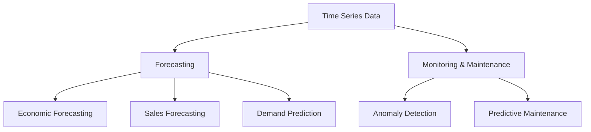
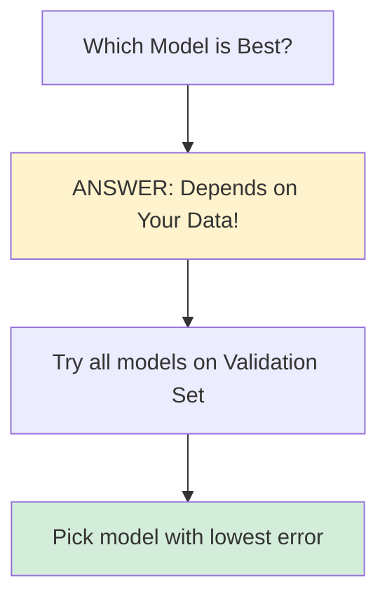
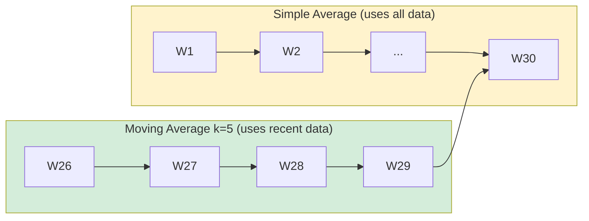
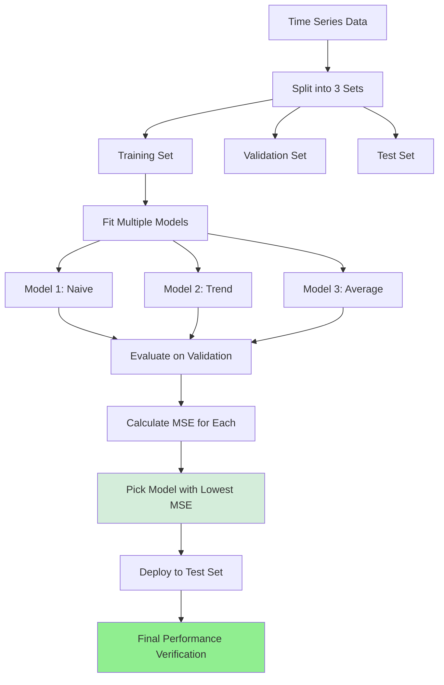
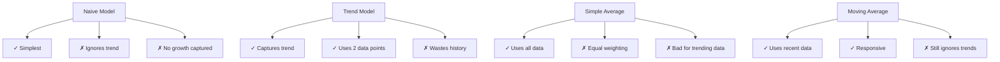

# Time Series Modeling & RNNs - Lecture Notes

**Date:** February 8, 2026  
**Language:** English  
**Model:** Whisper Medium  
**Session ID:** session_78257ce2_20260208_090534

---

## Table of Contents
1. [Introduction to Time Series](#introduction-to-time-series)
2. [Types and Examples](#types-and-examples)
3. [Applications](#applications)
4. [Forecasting Models](#forecasting-models)
5. [Model Evaluation](#model-evaluation)
6. [Advanced Topics](#advanced-topics)

---

## Introduction to Time Series

**Timestamp: 09:05:52 - 09:08:24**

### Definition

A **time series** is an **ordered sequence of values of a variable measured at equally spaced time intervals**.

**Key Components:**
- **Ordered**: Values follow a time sequence (e.g., 1921 → 1931 → 1941)
- **Variable**: The metric being measured (e.g., salary, temperature, stock price)
- **Equally spaced**: Consistent time intervals between measurements

**Example:**
```
Year: 1921 → 1931 → 1941 → 1951 → 1961 → 1971
Population (millions): 200 → 250 → 300 → 350 → 400 → 450
Time interval: 10 years (equally spaced)
```

### Types of Time Series

| Type | Characteristic | Example |
|------|-----------------|---------|
| **Regular Time Series** | Equal spacing between data points | Daily stock prices, monthly sales |
| **Irregular Time Series** | Unequal spacing (faulty measurement or random events) | Temperature from broken thermometer, shop entry times |

> **Business Importance**: Regular time series are most commonly used in business applications.

**Why Irregular Time Series Occur:**
- Faulty sensors or equipment
- Random events (customer arrivals)
- Data collection issues
- Missing measurements

---

## Types and Examples

**Timestamp: 09:06:09 - 09:07:50**

### Common Time Series in Real World

#### 1. **Financial Time Series**
- Stock market indices: BSE, NSE, NASDAQ
- Stock prices and trading volumes
- Currency exchange rates
- Used for: Trading, investment decisions, market analysis

#### 2. **Weather-Based Time Series**
- Temperature readings (hourly, daily, monthly)
- Precipitation amounts
- Global land-ocean temperature
- Wind speed and direction

#### 3. **Business Time Series**
- Sales data (daily, weekly, monthly)
- Inventory levels
- Employee salary progression
- Customer traffic

#### 4. **Population & Census Data**
- Population counts
- Census measurements
- Measured every 10 years (decade granularity)

### Granularity Levels

**Granularity** = Time spacing between measurements

```
Daily:     Monday → Tuesday → Wednesday → Thursday → Friday
           (Used for: Milk packet sales, daily transactions)

Yearly:    2020 → 2021 → 2022 → 2023
           (Used for: GDP, annual revenue)

Decadal:   1961 → 1971 → 1981 → 1991 → 2001
           (Used for: Census, population studies)
```

---

## Applications

**Timestamp: 09:09:30 - 09:12:14**

### Two Main Use Cases



### 1. **Forecasting** (Primary Focus of This Lecture)

**Definition**: Use past observations to predict future values

**Real-World Applications:**

| Domain | Example | Impact |
|--------|---------|--------|
| **Economics** | GDP, inflation rates | Policy decisions |
| **Sales** | Next month's sales, Diwali demand | Inventory planning |
| **Supply Chain** | Demand, supply, inventory levels | Stock management |
| **Agriculture** | Crop yield projections | Farm planning |
| **Retail** | Customer demand patterns | Stock replenishment |

**Why It Matters:**
- Help businesses plan better
- Reduce waste and costs
- Improve decision-making
- Enable efficient resource allocation

### 2. **Monitoring & Predictive Maintenance**

**Real Example**: Medical Refrigerator Failure Prediction
- Medical refrigerators store transplantable organs (critical)
- Multiple sensors track temperature, humidity, vibration
- Early warning system for failures prevents organ loss
- Combines anomaly detection + time series analysis

---

## Forecasting Models

**Timestamp: 09:13:57 - 09:27:02**

### Historical Context

> Time series analysis has been studied for **over 4 decades** - even before modern machine learning emerged. It's a classical statistical discipline.

### Model Progression Strategy

```
Simple Statistical Models 
    ↓
More Complex Models 
    ↓
Deep Learning (RNNs, Transformers)
```

We'll start simple and gradually increase complexity.

---

### Model 1: Naive Forecast (No Change Model)

**Timestamp: 09:14:35 - 09:15:33**

**Formula:**
$$\hat{y}_{t+1} = y_t$$

**Interpretation**: The next value will be exactly the same as the current value

**Example:**
```
Current Salary: ₹1,000,000
Predicted Next Year: ₹1,000,000 (No hike)
```

**Pros:**
- Extremely simple
- Works when data is stable with no trend

**Cons:**
- ❌ Ignores inflation
- ❌ Ignores growth trends
- ❌ Unrealistic for salary/stock data
- ❌ Nobody likes "no hike"!

**When to Use:**
- Very stable measurements (e.g., room temperature in controlled environment)
- Short-term predictions where trend is negligible

---

### Model 2 & 3: Trend-Based Models

**Timestamp: 09:15:33 - 09:19:56**

#### **Understanding Trend Intuitively**

When asked about salary growth, people typically say:
- "I got a **₹5 lakh hike**" (Additive: absolute increase)
- "I got a **10% raise**" (Multiplicative: percentage increase)

Both are ways of thinking about **trend** = How much the value is changing.

#### **Model 2A: Additive Trend**

**Formula:**

$$\hat{y}_{t+1} = y_t + \left(y_t - y_{t-1}\right)$$

Or equivalently:

$$\hat{y}_{t+1} = y_t + \Delta y_t$$

**Where:**
- $y_t$ = Current value (current year salary)
- $y_{t-1}$ = Previous value (previous year salary)
- $(y_t - y_{t-1})$ = Change/hike from last period

**Example:**
```
Previous Year (y_{t-1}):  ₹1,000,000
Current Year (y_t):       ₹1,100,000
Change (Hike):            ₹100,000
Predicted Next Year:      ₹1,100,000 + ₹100,000 = ₹1,200,000
```

**Use Case**: When change is consistent in absolute value

#### **Model 2B: Multiplicative Trend**

**Formula:**
$$\hat{y}_{t+1} = y_t \times \frac{y_t}{y_{t-1}}$$

**Interpretation**: Multiply current value by the growth ratio

**Example:**
```
Previous Year (y_{t-1}):  ₹1,000,000
Current Year (y_t):       ₹1,100,000
Growth Ratio:             1,100,000 ÷ 1,000,000 = 1.10 (10% growth)
Predicted Next Year:      ₹1,100,000 × 1.10 = ₹1,210,000
```

**Use Case**: When change is percentage-based (more realistic for most growing entities)

---

### Model Comparison So Far

**Timestamp: 09:20:16 - 09:20:54**



**Key Insight**: There's **no universally best model**. You must test empirically.

---

### Model 4: Simple Average

**Timestamp: 09:23:04 - 09:25:44**

**Formula:**
$$\hat{y}_{t+1} = \frac{1}{n} \sum_{i=1}^{n} y_i$$

**Interpretation**: Average all historical values equally

**Example (10-year salary history):**
```
Years 1-10 salaries: ₹50L, ₹55L, ₹60L, ₹65L, ₹70L, ₹75L, ₹80L, ₹85L, ₹90L, ₹100L
Average: (50+55+60+65+70+75+80+85+90+100)/10 = ₹77L
Prediction for Year 11: ₹77L
```

**Pros:**
- Uses entire historical data (doesn't waste data!)
- Captures overall central tendency

**Cons:**
- ❌ Doesn't account for inflation
- ❌ Gives equal weight to old (year 1) and recent (year 10) data
- ❌ Ignores trends
- ❌ Unrealistic for salary in high-inflation environment

> **Why it fails for salary:** Your salary from 10 years ago was maybe ½ or ¼ of current salary. Averaging them pulls prediction down unrealistically.

**When to Use:**
- Stable environmental measurements (room temperature from past 10 minutes)
- Data without significant trends
- Short-term, stable scenarios

---

### Incremental Update Formula (for Efficiency)

**Timestamp: 09:27:02 - 09:28:53**

**Problem**: If you have 1 million data points, recalculating average each time is expensive.

**Solution**: Incremental update formula

**Formula:**
$$\hat{y}_{t+2} = \frac{t \times \hat{y}_{t+1} + y_{t+1}}{t+1}$$

**How It Works:**
1. Don't recalculate the entire average
2. Reuse the previously calculated sum: $t \times \hat{y}_{t+1}$
3. Add new actual value: $y_{t+1}$
4. Divide by new count: $t+1$

**Benefit**: O(1) time complexity instead of O(n)

---

### Model 5: Moving Average

**Timestamp: 09:35:17 - 09:36:49**

**Formula:**
$$\hat{y}_{t+1} = \frac{1}{k} \sum_{i=t-k+1}^{t} y_i$$

**Interpretation**: Average only the **k most recent values** (sliding window)

**Example (k=5 week moving average):**
```
Week:              26    27    28    29    30    31(prediction)
Purchases:         100   110   105   115   120   ?

To predict Week 31:
Take last 5 values: (100 + 110 + 105 + 115 + 120) / 5 = 110

Prediction: 110 purchases in Week 31
```

**Comparison with Simple Average:**
```
Simple Average (k=30):
  Uses all 30 weeks equally
  Influenced by weeks 1-25 
  
Moving Average (k=5):
  Uses only last 5 weeks
  Weights recent data more heavily
  Responds faster to changes
```

**Visual Representation:**



**How to Choose k:**
- **Smaller k** (k=3): Responsive to changes, noisy
- **Larger k** (k=20): Smooth trends, lags changes
- **Solution**: Test on validation set, pick k with best performance

**Practical Example: 30-Week Purchase Data**

**Timestamp: 09:37:12 - 09:39:11**

Suppose you have 30 weeks of purchase data:

```
Week:       1    2    3  ...  28   29   30   31 (predict)
Purchases: 285  290  275 ... 300  310  320   ?
```

**Step 1: Try Moving Average with k=5**

For week 31, take the last 5 weeks (weeks 26-30):
```
Week 26: ~280
Week 27: ~295
Week 28: ~300
Week 29: ~310
Week 30: 320

Moving Average = (280 + 295 + 300 + 310 + 320) / 5 = 289.8 purchases
```

**Step 2: Test Different Values of k**

Try multiple k values on your validation data:
```
k=3:  Prediction with last 3 weeks   → MSE = X
k=4:  Prediction with last 4 weeks   → MSE = Y
k=5:  Prediction with last 5 weeks   → MSE = 289.8 ✓ (lowest)
k=6:  Prediction with last 6 weeks   → MSE = Z
k=10: Prediction with last 10 weeks  → MSE = W
```

**Step 3: Pick the k with Lowest Error**

Whichever k gives the lowest MSE on validation set is the one you use for predictions.

**Why Testing is Essential:**
- Different data patterns favor different k values
- Too small k → overfits to noise, jumpy predictions
- Too large k → misses recent changes, slow to adapt
- Optimal k balances responsiveness with stability

**Limitations:**
- ❌ Doesn't capture trends (all values averaged equally)
- ❌ Doesn't capture seasonality (repeating patterns)
- ✓ Better than simple average for recent-focused predictions
- ✓ Practical for data that fluctuates around a stable level

---

### Model 6: Exponential Smoothing (Single Exponential Smoothing)

**Timestamp: 09:41:41 - 10:01:43**

#### **Why Exponential Smoothing?**

Moving average has a limitation: it gives **equal weight** to all recent observations and **zero weight** to older ones.

**Problem**: What if older data is still somewhat important, but you want to emphasize recent observations more?

**Solution**: Use exponential smoothing with **exponentially decreasing weights**:
- Recent observations → High weight
- Older observations → Lower weight (decreasing exponentially)
- Very old observations → Almost zero weight

#### **The Exponential Smoothing Formula**

**Recurrence Relation:**
$$S_t = \alpha y_t + (1 - \alpha) S\_{t-1}$$

**Where:**
- $S_t$ = Smoothed value (forecast) at time $t$
- $y_t$ = Actual observation at time $t$
- $\alpha$ = Smoothing parameter (0 ≤ α ≤ 1)
- $(1-\alpha)$ = Weight on previous smoothed value
- **Base Case**: $S_1 = y_1$ (first smoothed value equals first observation)

**Interpretation:**
- $\alpha$ controls how much weight goes to the current observation
- $(1-\alpha)$ controls how much weight goes to historical data
- This is **recursive** - each forecast depends on the previous forecast

#### **Understanding the Recursion**

When you expand the formula recursively, you get:

$$S_t = \alpha y_t + (1-\alpha)[\alpha y\_{t-1} + (1-\alpha)S\_{t-2}]$$

$$S_t = \alpha y_t + \alpha(1-\alpha)y\_{t-1} + (1-\alpha)^2 S\_{t-2}$$

Expanding further:
$$S_t = \alpha y_t + \alpha(1-\alpha)y\_{t-1} + \alpha(1-\alpha)^2 y\_{t-2} + \ldots$$

**Weights Distribution:**
- Coefficient of $y_t$ = $\alpha$
- Coefficient of $y\_{t-1}$ = $\alpha(1-\alpha)$
- Coefficient of $y\_{t-2}$ = $\alpha(1-\alpha)^2$
- And so on... decreasing exponentially!

#### **Impact of α (Alpha)**

**When α = 0.9 (Fast Dampening):**
- $y_t$ gets 90% weight
- $y\_{t-1}$ gets 9% weight
- $y\_{t-2}$ gets 0.9% weight
- Older observations → nearly zero weight
- **Result**: Very responsive to recent changes

**When α = 0.5 (Medium Dampening):**
- $y_t$ gets 50% weight
- $y\_{t-1}$ gets 25% weight
- $y\_{t-2}$ gets 12.5% weight
- Older observations → still meaningful weight
- **Result**: Balanced between history and recent data

**When α = 0.1 (Slow Dampening):**
- $y_t$ gets 10% weight
- $y\_{t-1}$ gets 9% weight
- Older observations → significant weight
- **Result**: Heavily influenced by historical average

#### **Practical Example: Time Series Forecast**

**Timestamp: 09:49:16 - 09:54:57**

Suppose you have this time series:
```
Time (t):        1    2    3    4    5    6    7    8    9    10   11   12
Observation:    71   70   69   68   69   71   72   71   70   71   72   70
```

**Step 1: Set Base Case**
$$S_1 = y_1 = 71$$

**Step 2: Calculate S₂ using α = 0.1**
$$S_2 = 0.1 \times 70 + 0.9 \times 71 = 7 + 63.9 = 70.9$$

**Step 3: Calculate S₃ using same formula**
$$S_3 = 0.1 \times 69 + 0.9 \times 70.9 = 6.9 + 63.81 = 70.71$$

Continue this for all time points...

**Step 4: Calculate Residuals and MSE**

```
Time  | y_t  | S_t   | Error    | Error²
------|------|-------|----------|--------
1     | 71   | 71.0  | 0.0      | 0.00
2     | 70   | 70.9  | -0.9     | 0.81
3     | 69   | 70.71 | -1.71    | 2.92
...   | ...  | ...   | ...      | ...
12    | 70   | ?     | ?        | ?
```

**Sum of Squared Errors** = 208.94 (for α = 0.1)

#### **Finding Optimal α (Grid Search)**

Since you don't know which α is best, test multiple values:

```
α     | MSE     | Rank
------|---------|------
0.1   | 208.94  | 5 (worst)
0.2   | 195.43  | 4
0.3   | 182.15  | 3
0.4   | 171.28  | 2
0.5   | 160.29  | 1 (best) ✓
0.6   | 165.47  | 3
0.7   | 172.56  | 4
```

**Finding 0.5 is best:**
1. Start with coarse grid: 0.1, 0.2, ..., 1.0
2. Find that 0.5 is best
3. Refine around 0.5: Try 0.45, 0.46, 0.47, 0.48, 0.49, 0.50, 0.51, 0.52, 0.53, 0.54, 0.55
4. If 0.52 is best, refine further: 0.515, 0.516, 0.517, ..., 0.525
5. Use the α with **lowest MSE**

**Why Recursion Matters:**
```
You can't "unroll" the full formula easily because 
S_t depends on S_{t-1}
S_{t-1} depends on S_{t-2}
... and so on

So you compute step-by-step forward in time!
```

#### **Key Characteristics**

**Advantages:**
- ✓ Captures weighted history (recent > older)
- ✓ Single parameter (α) to tune
- ✓ Computationally efficient
- ✓ Works well with noisy data

**Limitations:**
- ❌ **Doesn't capture trend** (subject of "Double Exponential Smoothing")
- ❌ Lags behind actual trend changes
- ❌ Only one parameter to control behavior

#### **What is "Dampening"?**

**Definition**: Reducing importance over time

- As observations get older, their influence **dampens** (reduces)
- **Fast dampening** (high α): Older data quickly becomes irrelevant
- **Slow dampening** (low α): Older data remains important longer
- Speed of dampening controlled by **α value**

**Related Term**: **Attenuating** = same concept, reducing over time

---

## Q&A Session Highlights (Continued)

**Timestamp: 09:41:41 - 10:01:43**

### Q5: Does exponential smoothing capture trends?
**A**: 
- Partially - it gives higher importance to recent observations
- But it doesn't **explicitly** capture trend patterns
- For better trend capture: **Double Exponential Smoothing** (next model)
- Single smoothing works better with short-term fluctuations

### Q6: Why is α a hyperparameter?
**A**: 
- Must be discovered through experimentation
- No mathematical formula to derive optimal α
- Use grid search on validation data
- Try range of values (0.1, 0.2, ..., 0.9) and pick best MSE

### Q7: How is residual calculated?
**A**: 
$$\text{Residual} = y_t - S_t = \text{Actual} - \text{Predicted}$$

Example: If actual = 268 and predicted = 289.8:
$$\text{Residual} = 268 - 289.8 = -21.8$$

**Why it matters**: Sum of squared residuals gives you MSE to compare models

### Q8: What happens when α < 0.5?
**A**: 
- Recent observations get less than 50% weight
- Older observations get more influence
- Slower dampening - takes longer to forget old data
- Good for very stable trends
- Bad for data with sudden changes

---

## Model Evaluation

**Timestamp: 09:20:36 - 09:22:11**

### Why We Have Multiple Models

**Problem**: We have 10+ years of salary history. Using only last year to predict:
- Wastes 9+ years of valuable data!
- Data is precious - especially actual, manually-verified data (not AI-generated)

### The Testing Workflow



### Regression Metrics for Time Series

Since time series forecasting is a **regression problem** (predicting continuous values):

**Mean Squared Error (MSE):**
$$MSE = \frac{1}{n} \sum_{i=1}^{n} (y_i - \hat{y}_i)^2$$

**Other Common Metrics:**
| Metric | Formula | When to Use |
|--------|---------|-------------|
| **MAE** | $\frac{1}{n}\sum \|y_i - \hat{y}_i\|$ | Interpretable, less sensitive to outliers |
| **RMSE** | $\sqrt{MSE}$ | Same units as target variable |
| **MAPE** | $\frac{1}{n}\sum \|\frac{y_i - \hat{y}_i}{y_i}\|\times 100\%$ | Percentage error |

**Decision Rule**: Lower error = Better model

---

## Comparison of Simple Models

**Timestamp: 09:20:20 - 09:22:27**



---

## Q&A Session Highlights

**Timestamp: 09:29:11 - 09:34:31**

### Q1: What does "Monitoring" mean?
**A**: Continuous recording of time series values to detect anomalies
- Monitor sensor data from devices
- Detect unusual patterns
- Enable predictive maintenance before failure

### Q2: Where do you get the data?
**A**: Multiple sources:
- **HR Systems**: SuccessFactors, Workday (employee data)
- **Sensors**: Medical devices, cars, fitness trackers (10+ sensors each)
- **APIs**: Stock market data (Yahoo Finance, Alpha Vantage)
- **IoT**: Smart buildings, industrial equipment

### Q3: How to calculate y(t+2) without actual value?
**A**: Use estimated value recursively:
$$\hat{y}_{t+2} = \frac{t \times \hat{y}_{t+1}}{t+1}$$
(Once actual value arrives, update incrementally)

### Q4: How is time series different from linear regression?
**A**: They're **similar**:
- Can view previous time points as features in regression
- Regress on future value

**Key Difference**:
- Linear regression needs many independent samples (n >> features)
- Time series can work with few data points using domain knowledge
- 10 years salary = 10 samples for linear regression = too few
- But time series models handle this well

---

## Key Learnings

### The Hierarchy of Models

**Complexity vs Utility:**
```
Complexity    ↑
              |    RNNs (Advanced)
              |    ↑
              |  Exponential Smoothing
              |    ↑
              |  Moving Average
              |    ↑
              |  Trend-Based
              |    ↑
              |  Simple Average
              |    ↑
              |  Naive Model
              |________________→ Predictive Power
```

### Critical Principles

1. **No Universal Best Model**
   - Test multiple models on your specific data
   - Validation set is your ground truth

2. **Data is Precious**
   - Use all available historical data when possible
   - Simple average > models that throw away history

3. **Temporal Order Matters**
   - Always split: Train → Validation → Test (in time order)
   - Never mix future data into training

4. **Granularity is Important**
   - Daily, weekly, monthly data need different models
   - Choose based on your forecasting horizon

---

## Advanced Topics Covered

### Yet to be covered:
- Double Exponential Smoothing (with trend)
- ARIMA models
- Seasonality detection
- RNNs for time series
- Transformer models

---

## Summary Table

| Model | Formula | Complexity | Use Case |
|-------|---------|-----------|----------|
| **Naive** | $\hat{y}_{t+1} = y_t$ | ⭐ | Stable data |
| **Additive Trend** | $\hat{y}_{t+1} = y_t + (y_t - y_{t-1})$ | ⭐⭐ | Linear growth |
| **Multiplicative Trend** | $\hat{y}_{t+1} = y_t \times \frac{y_t}{y_{t-1}}$ | ⭐⭐ | % growth |
| **Simple Average** | $\hat{y}_{t+1} = \frac{1}{n}\sum y_i$ | ⭐ | Noisy data |
| **Moving Average** | $\hat{y}_{t+1} = \frac{1}{k}\sum_{i=t-k+1}^{t} y_i$ | ⭐⭐ | Trending data |
| **Exponential Smoothing** | $S_t = \alpha y_t + (1-\alpha)S_{t-1}$ | ⭐⭐⭐ | Weighted history |

---

**Last Updated**: Session timestamp 09:41:41 - 10:01:43  
**Status**: Covers Introduction through Exponential Smoothing with Practical Examples  
**Coverage**: ~56 minutes of lecture (09:05:52 - 10:01:43)  
**Next Topics Expected**: Double Exponential Smoothing, ARIMA, Seasonality, RNNs
