# Keras Framework - Complete Study Notes
**Session Date:** February 7, 2026  
**Topic:** Introduction to Keras Deep Learning Framework  
**Level:** Beginner to Intermediate

---

## 📌 Version Control
**Last Updated:** [11:14:47] February 7, 2026  
**Transcription Coverage:** Session start → [11:14:47]  
**Status:** 🟢 Live session in progress - Break at [11:14:47] (returning by 11:30)

---

## 📚 Table of Contents
1. [Introduction to Deep Learning](#introduction-to-deep-learning)
2. [What is Keras?](#what-is-keras)
3. [Evolution of Keras](#evolution-of-keras)
4. [Why Use Keras?](#why-use-keras)
5. [Key Features](#key-features)
6. [Backend Support](#backend-support)
7. [Three API Styles in Keras](#three-api-styles-in-keras)
8. [Sequential API - Deep Dive](#sequential-api---deep-dive)
9. [Neural Network Parameters](#neural-network-parameters)
10. [Practical Example - Iris Dataset](#practical-example---iris-dataset)
11. [Advanced Features (2025)](#advanced-features-2025)
12. [Functional API Introduction](#functional-api-introduction)
13. [Functional API Characteristics](#functional-api-characteristics)
14. [Hyperparameter Tuning with Keras Tuner](#hyperparameter-tuning-with-keras-tuner)
15. [Q&A: Early Stopping & Accuracy Management](#qa-early-stopping--accuracy-management)
16. [Production-Level Implementation](#production-level-implementation)
17. [Session Summary](#session-summary)

---

## 1. Introduction to Deep Learning

### The Problem with Classical Machine Learning
Classical machine learning has two major limitations:
- **Cannot handle huge amounts of data** effectively
- **Limited to structured/tabular data** - struggles with unstructured data like images, audio, and text

### Solution: Deep Neural Networks
Deep learning mimics the human brain's neural structure to overcome these limitations.


### Types of Neural Networks


**Detailed Explanation:**
- **Perceptron**: The simplest neural network (1950s) - single layer, basic binary classification
- **MLP (Multi-Layer Perceptron)**: Multiple layers of neurons, can solve non-linear problems
- **CNN (Convolutional Neural Network)**: Specialized for image processing, uses filters to detect features
- **RNN (Recurrent Neural Network)**: For sequential data like text, time series
- **LSTM (Long Short-Term Memory)**: Advanced RNN that remembers long-term patterns

---

## 2. What is Keras?

### Definition
**Keras** is a high-level deep learning framework written entirely in **Python**, designed for fast experimentation with deep learning models.

### Key Points
- 🐍 **Language**: 100% Python
- ⚡ **Purpose**: Fast prototyping and experimentation
- 👨‍💻 **Creator**: François Chollet (Google AI researcher)
- 🔬 **Origin**: Part of the ONEIRO research project
- 🌍 **Adoption**: 300+ million developers worldwide

### Why Frameworks Are Needed


**Additional Context:**
- Just like you need a web framework (Flask, Django) to build websites, you need a deep learning framework to build neural networks
- Frameworks handle complex mathematical operations (matrix multiplications, backpropagation) automatically
- They provide pre-built layers, optimizers, and loss functions

---

## 3. Evolution of Keras

### Timeline and Versions


### Detailed Version Breakdown

#### 🔵 Keras 1.x (2015-2019)
- **Status**: Standalone framework
- **Backends**: Theano, TensorFlow
- **Installation**: Separate package `pip install keras`
- **Limitation**: Only 2 backend options

#### 🟢 Keras 2.x (2019-2023)
- **Status**: Integrated into TensorFlow
- **Access**: `tf.keras` (TensorFlow 2.0+)
- **Installation**: Comes with TensorFlow
- **Key Change**: Became Google's official high-level API
- **Developer**: François Chollet (Google employee)

**Code Example:**
```python
# Keras 1.x (old way)
from keras.models import Sequential

# Keras 2.x (TensorFlow integrated)
from tensorflow.keras.models import Sequential
```

#### 🟡 Keras 3.x (2023-Present)
- **Revolutionary Change**: Multi-backend support
- **Supported Backends**: 
  - JAX (Google)
  - TensorFlow (Google)
  - PyTorch (Meta/Facebook)
  - OpenVINO (Intel)
- **Flexibility**: Write once, deploy anywhere


#### ⚡ Keras 3.13+ (2025 Features)
1. **LiteRT Export**: Deploy to mobile and embedded devices
2. **ONNX Support**: Universal model format for cross-platform deployment
3. **Quantization**: Reduce model size without losing accuracy

**Quantization Example:**
- Original Model: 500 MB
- Quantized Model: 125 MB (4x smaller!)
- Performance: ~Same accuracy, 4x faster inference

---

## 4. Why Use Keras?

### Core Advantages


### Detailed Benefits

#### 1. 🐍 **Python Native**
- Written entirely in Python (no C++ knowledge needed)
- Pythonic API design (follows Python conventions)
- Easy integration with NumPy, Pandas, scikit-learn

#### 2. 🧩 **Modular Design**
- Models are built like LEGO blocks
- Each layer is an independent module
- Easy to add, remove, or modify components

**Example:**
```python
model = Sequential([
    Dense(128, activation='relu'),    # Module 1
    Dropout(0.5),                     # Module 2
    Dense(10, activation='softmax')   # Module 3
])
```

#### 3. 🔄 **Multi-Backend Support** (Keras 3.x)
- Write code once, choose backend later
- Switch backends without changing code
- Use best backend for your hardware

```mermaid
graph LR
    A[Same Keras Code] --> B{Deployment Target}
    B --> C[Cloud/Server → TensorFlow]
    B --> D[Research → JAX]
    B --> E[Production → PyTorch]
    B --> F[Edge Devices → OpenVINO]
    
    style A fill:#90EE90
```



#### 4. 👥 **300+ Million Developer Community**
- Extensive tutorials and courses
- Active forums and support
- Thousands of pre-trained models
- Quick bug fixes and updates

#### 5. ⚡ **Fast Prototyping**
- Build POC (Proof of Concept) in minutes
- Quick experimentation with architectures
- Rapid iteration cycles
- Ideal for research and development

#### 6. 🎯 **Best-in-Class Performance**
- Optimized for production deployment
- Efficient on GPUs, CPUs, and TPUs
- Edge device optimization
- Memory-efficient implementations

#### 7. 🏗️ **Full Architecture Support**
- Supports all modern neural network types
- Pre-built layers for common architectures
- Custom layer creation possible
- Transfer learning support

---

## 5. Key Features

### Model Types in Keras


**When to Use Each:**
- **Sequential**: 90% of use cases, simple feed-forward networks
- **Functional**: Multi-input/output models, skip connections (ResNet), shared layers
- **Subclassing**: Custom training loops, research, non-standard architectures

---

## 6. Backend Support

### How Multi-Backend Works


### Backend Selection Guide

| Backend | Best For | Strengths |
|---------|----------|-----------|
| **TensorFlow** | Production, Google Cloud | Industry standard, extensive tools |
| **JAX** | Research, High Performance | Fastest, automatic differentiation |
| **PyTorch** | Research, Dynamic Models | Flexible, pythonic, great debugging |
| **OpenVINO** | Intel Hardware, Edge | Optimized for Intel CPUs/GPUs |

**Setting Backend:**
```python
import os
os.environ['KERAS_BACKEND'] = 'jax'  # or 'tensorflow', 'pytorch'

import keras
```

---

## 7. Three API Styles in Keras

Just like there are multiple ways to solve a programming problem (sequential code, functions, or classes), Keras offers three different ways to build neural networks:


### Comparison with Programming Styles

**Think of a simple task: Check if a number is prime**


**E12ample Code Analogy:**

```python
# Method 1: Direct Code (like Sequential API)
number = 17
is_prime = True
for i in range(2, number):
    if number % i == 0:
        is_prime = False
print(is_prime)

# Method 2: Function (like Functional API)
def check_prime(number):
    for i in range(2, number):
        if number % i == 0:
            return False
    return True

result = check_prime(17)

# Method 3: Class (like Model Subclassing)
class PrimeChecker:
    def check(self, number):
        for i in range(2, number):
            if number % i == 0:
                return False
        return True

checker = PrimeChecker()
result = checker.check(17)
```

### API Style Comparison

| Feature | Sequential API | Functional API | Model Subclassing |
|---------|---------------|----------------|-------------------|
| **Complexity** | Simple | Medium | Advanced |
| **Use Case** | Single path networks | Multi-input/output, branches | Custom training logic |
| **Code Style** | Stack layers one by one | Define connections explicitly | Define as Python class |
| **Flexibility** | Low | High | Highest |
| **Best For** | Beginners, simple models | Intermediate, ResNet/Inception | Researchers, custom models |
| **Example** | 95% of basic use cases | Multi-task learning, skip connections | GANs, custom training loops |

---

## 8. Sequential API - Deep Dive

### What is Sequential API?

The **Sequential API** is the simplest way to build neural networks in Keras. It's called "sequential" because you literally stack layers one after another in sequence.


### Key Characteristics

#### 1. 🔗 **Linear Stack of Layers**
- One layer follows another
- No branching or merging
- Simple pipeline: Input → Hidden Layers → Output

#### 2. 🎯 **Single Input, Single Output**
- **Single Input**: One dataset with features (e.g., Iris dataset with 4 features)
- **Single Output**: One prediction task (e.g., classify flower species)

**Examples of Single Input/Output:**
---

## 📖 Quick Reference Guide

### Model Building Checklist


### Common Hyperparameter Values

| Parameter | Typical Range | Default/Recommended |
|-----------|---------------|---------------------|
| Learning Rate | 0.0001 - 0.01 | 0.001 (Adam) |
| Batch Size | 16 - 512 | 32 or 64 |
| Epochs | 10 - 200 | 50 with early stopping |
| Dropout | 0.2 - 0.5 | 0.3 - 0.5 |
| Hidden Layer Neurons | 16 - 512 | Start with 64-128 |
| Number of Hidden Layers | 1 - 10 | 2-3 for simple problems |

### Activation Function Quick Guide

```python
# Hidden layers (choose one)
activation='relu'        # 🌟 Most common
activation='leaky_relu'  # If ReLU causes dead neurons
activation='tanh'        # For centered data

# Output layer
activation='sigmoid'     # Binary classification (0 or 1)
activation='softmax'     # Multi-class classification
activation='linear'      # Regression (any number)
```

### Loss Function Quick Guide

```python
# Classification
loss='binary_crossentropy'      # Binary (2 classes)
loss='categorical_crossentropy'  # Multi-class (one-hot encoded)
loss='sparse_categorical_crossentropy'  # Multi-class (integer labels)

# Regression
loss='mse'   # Mean Squared Error
loss='mae'   # Mean Absolute Error
loss='huber' # Robust to outliers
```

---

## 💡 Key Concepts Summary

### Depth vs Width


**Rule of Thumb:**
- Start simple: 2-3 hidden layers with 64-128 neurons
- Increase gradually if underfitting
- Use regularization (dropout, L2) if overfitting

### The Training Process


**Steps in Detail:**
1. **Forward Pass**: Data flows through layers → predictions
2. **Loss Calculation**: Compare predictions with true labels
3. **Backward Pass**: Calculate how to adjust weights (backpropagation)
4. **Weight Update**: Optimizer updates weights using gradients
5. **Repeat**: Until convergence or max epochs reached

---

## 🎓 Study Tips for Beginners

### Understanding Neural Networks

**Think of it like learning:**
- **Depth**: How many subjects you study (breadth of knowledge)
- **Width**: How deep you go in each subject (depth per topic)
- **Training**: Practicing with examples (learning from data)
- **Epochs**: How many times you review the material
- **Batch Size**: How many problems you solve before checking answers

### Common Mistakes to Avoid


### Practice Progression

1. **Week 1**: Build Sequential models with simple datasets (Iris, MNIST)
2. **Week 2**: Experiment with different architectures and hyperparameters
3. **Week 3**: Learn Functional API for complex architectures
4. **Week 4**: Implement real projects with full pipeline
5. **Week 5+**: Model Subclassing and custom training loops

---

---

## 📖 Quick Reference: Code Snippets

### Minimal Sequential Model

```python
from tensorflow import keras
from tensorflow.keras import layers

model = keras.Sequential([
    layers.Dense(64, activation='relu', input_shape=(10,)),
    layers.Dense(32, activation='relu'),
    layers.Dense(1, activation='sigmoid')  # Binary classification
])

model.compile(optimizer='adam', loss='binary_crossentropy', metrics=['accuracy'])
model.fit(X_train, y_train, epochs=10)
```

### Multi-class Classification Complete Flow

```python
from tensorflow.keras.utils import to_categorical
from sklearn.preprocessing import StandardScaler

# Prepare
scaler = StandardScaler()
X_train = scaler.fit_transform(X_train)
X_test = scaler.transform(X_test)
y_train = to_categorical(y_train)
y_test = to_categorical(y_test)

# Build
model = keras.Sequential([
    layers.Dense(128, activation='relu', input_shape=(X_train.shape[1],)),
    layers.Dense(64, activation='relu'),
    layers.Dense(num_classes, activation='softmax')
])

# Compile & Train
model.compile(optimizer='adam', loss='categorical_crossentropy', metrics=['accuracy'])
model.fit(X_train, y_train, validation_split=0.2, epochs=50)

# Evaluate
loss, acc = model.evaluate(X_test, y_test)
predictions = model.predict(X_test)
```

### With Early Stopping to Prevent Overfitting

```python
from tensorflow.keras.callbacks import EarlyStopping

early_stop = EarlyStopping(
    monitor='val_loss',
    patience=5,  # Stop if no improvement for 5 epochs
    restore_best_weights=True
)

model.fit(X_train, y_train, 
          validation_split=0.2,
          epochs=100,
          callbacks=[early_stop])
```

---

## 📊 Visual Summary: Iris Network Architecture

```mermaid
graph LR
    subgraph Input["Input Layer<br/>(4)"]
        I1["Sepal Length"]
        I2["Sepal Width"]
        I3["Petal Length"]
        I4["Petal Width"]
    end
    
    subgraph H1["Hidden 1<br/>(8 neurons)<br/>ReLU"]
        H1_1["n₁"] H1_2["n₂"] H1_3["..."] H1_8["n₈"]
    end
    
    subgraph H2["Hidden 2<br/>(10 neurons)<br/>ReLU"]
        H2_1["n₁"] H2_2["n₂"] H2_3["..."] H2_10["n₁₀"]
    end
    
    subgraph H3["Hidden 3<br/>(10 neurons)<br/>ReLU"]
        H3_1["n₁"] H3_2["n₂"] H3_3["..."] H3_10["n₁₀"]
    end
    
    subgraph Output["Output Layer<br/>(3)<br/>Softmax"]
        O1["Setosa"]
        O2["Versicolor"]
        O3["Virginica"]
    end
    
    I1 --> H1_1
    I1 --> H1_8
    I2 --> H1_1
    I4 --> H1_8
    
    H1_1 --> H2_1
    H1_8 --> H2_10
    
    H2_1 --> H3_1
    H2_10 --> H3_10
    
    H3_1 --> O1
    H3_1 --> O2
    H3_10 --> O3
    
    style Input fill:#90EE90
    style H1 fill:#87CEEB
    style H2 fill:#87CEEB
    style H3 fill:#87CEEB
    style Output fill:#FFD700
```

**Total Parameters: 273**
- Layer 1→2: 40 params
- Layer 2→3: 90 params
- Layer 3→4: 110 params
- Layer 4→5: 33 params

---

## 🎓 Next Topics (Covered in Later Sessions)

The instructor mentioned these will be covered next:
1. **Functional API** - For models with multiple inputs/outputs
2. **Model Subclassing** - For complete custom control
3. **CNN (Convolutional Neural Networks)** - For image classification
4. **RNN (Recurrent Neural Networks)** - For sequence data
5. **Code implementation walkthrough** - Live coding examples

---

## 💾 Session Recording Information

**Recording Details:**
- Date: February 7, 2026
- Time: 09:08:45 onwards
- Duration: Continuing session
- Language: English
- Model Quality: Medium
- Transcription Service: Whisper

---

**Session Status**: 🟢 Live - Continuing...  
**Last Updated**: [09:53:51]

---

*Note: These notes are comprehensively enhanced with detailed explanations, diagrams, code examples, and beginner-friendly analogies. For official documentation, visit keras.io*

#### 3. ⚡ **Best for Quick Prototypes**
- Fast to write
- Easy to understand
- Perfect for beginners
- Suitable for simple classifiers

### Creating Sequential Models

**Two Ways to Build:**

```python
# Method 1: Add layers one by one
from tensorflow import keras
from tensorflow.keras import layers

model = keras.Sequential()
model.add(layers.Dense(64, activation='relu', input_shape=(4,)))
model.add(layers.Dense(32, activation='relu'))
model.add(layers.Dense(3, activation='softmax'))

# Method 2: List of layers (more concise)
model = keras.Sequential([
    layers.Dense(64, activation='relu', input_shape=(4,)),
    layers.Dense(32, activation='relu'),
    layers.Dense(3, activation='softmax')
])
```

### Building a Model: 4-Step Process


#### Step 1: Define Architecture
Set up the structure of your neural network

#### Step 2: Compile the Model
Configure how the model will learn

#### Step 3: Train (Fit) the Model
Feed data and let the model learn patterns

#### Step 4: Evaluate the Model
Test on unseen data and measure performance

---

## 9. Neural Network Parameters

When building any neural network, you need to specify three types of parameters:


### 1️⃣ Architecture Parameters

These define the **structure** of your neural network:

#### **a) Number of Layers (Depth)**
- How many layers in your network
- More layers = deeper network
- Example: Input + 3 hidden + Output = 5 layers total


**Typical Depths:**
- Shallow: 2-3 layers (simple problems)
- Medium: 4-10 layers (most problems)
- Deep: 10+ layers (complex problems like ImageNet)
- Very Deep: 50-152 layers (ResNet, etc.)

#### **b) Neurons per Layer (Width)**
- How many neurons in each layer
- More neurons = wider network
- Can capture more features

**Example:**
```
Layer 1: 128 neurons (wide)
Layer 2: 64 neurons (medium)
Layer 3: 32 neurons (narrow)
Output: 3 neurons (3 classes)
```

**Width = Maximum neurons in any layer = 128**

#### **c) Layer Connectivity Pattern**
- How layers connect to each other
- Sequential: Each layer connects to next only
- Advanced: Skip connections, residual connections

```mermaid
graph LR
    subgraph "Sequential Pattern"
        A1[Layer 1] --> A2[Layer 2] --> A3[Layer 3]
    end
    
    subgraph "Skip Connection Pattern"
        B1[Layer 1] --> B2[Layer 2]
        B2 --> B3[Layer 3]
        B1 -.skip.-> B3
    end
```

#### **d) Activation Functions**
Transform the output of each neuron

**Common Activation Functions:**

| Function | Formula | Use Case | Range |
|----------|---------|----------|-------|
| **ReLU** | max(0, x) | Hidden layers (most common) | [0, ∞) |
| **Sigmoid** | 1/(1+e^-x) | Binary classification output | (0, 1) |
| **Softmax** | e^xi / Σe^xj | Multi-class output | [0, 1], sum=1 |
| **Tanh** | (e^x - e^-x)/(e^x + e^-x) | Hidden layers (centered) | (-1, 1) |
| **LeakyReLU** | max(0.01x, x) | Avoid dead neurons | (-∞, ∞) |

```mermaid
graph TD
    A[Choosing Activation] --> B{Layer Type?}
    B -->|Hidden Layers| C[ReLU<br/>most common]
    B -->|Binary Output| D[Sigmoid<br/>0 or 1]
    B -->|Multi-class Output| E[Softmax<br/>probabilities]
    
    style C fill:#90EE90
```

#### **e) Dropout**
Randomly "drop" neurons during training to prevent overfitting

```python
model.add(layers.Dropout(0.5))  # Drop 50% of neurons
```

**How it works:**
- During training: Randomly set 50% of neuron outputs to 0
- During testing: Use all neurons (scaled appropriately)
- Prevents over-reliance on specific neurons

#### **f) Batch Normalization**
Normalizes inputs to each layer for faster training

```python
model.add(layers.BatchNormalization())
```

**Benefits:**
- Faster training convergence
- Allows higher learning rates
- Acts as regularization (slight dropout effect)

### 2️⃣ Training Parameters

These control **how the model learns**:

#### **a) Optimizer**
Algorithm that updates weights during training

**Popular Optimizers:**

```mermaid
graph TB
    A[Optimizers] --> B[SGD<br/>Stochastic Gradient Descent]
    A --> C[Adam<br/>Adaptive Moment Estimation]
    A --> D[RMSprop]
    A --> E[AdamW<br/>Adam with Weight Decay]
    A --> F[Lion<br/>Evolved optimizer]
    
    C --> G[Most Popular<br/>Default Choice]
    
    style C fill:#90EE90
```

**When to use which:**
- **Adam**: Default choice, works well for most problems (90% of cases)
- **SGD**: Simpler, sometimes better final accuracy with good tuning
- **RMSprop**: Good for RNNs
- **AdamW**: Better regularization than Adam
- **Lion**: Latest research, very efficient

#### **b) Loss Function**
Measures how wrong the model's predictions are

**Common Loss Functions:**

| Problem Type | Loss Function | Example |
|--------------|---------------|---------|
| Binary Classification | Binary Crossentropy | Cat vs Dog |
| Multi-class Classification | Categorical Crossentropy | Iris species |
| Regression | Mean Squared Error (MSE) | House prices |
| Multi-label Classification | Binary Crossentropy | Tag images |

#### **c) Learning Rate**
How big steps the optimizer takes when updating weights

```mermaid
graph LR
    A[Learning Rate] --> B[Too High<br/>0.1+]
    A --> C[Just Right<br/>0.001-0.01]
    A --> D[Too Low<br/>0.00001]
    
    B --> B1[Overshoots<br/>Doesn't converge]
    C --> C1[Converges well]
    D --> D1[Too slow<br/>Gets stuck]
    
    style C fill:#90EE90
```

**Typical values:**
- Default: 0.001 (Adam optimizer)
- Range: 0.0001 to 0.01
- Use learning rate scheduling for best results

#### **d) Number of Epochs**
How many times to go through the entire dataset

**Example:**
- 1 epoch = Model sees all training data once
- 50 epochs = Model sees all data 50 times

**Guidelines:**
- Start with 10-50 epochs
- Use early stopping to prevent overfitting
- More complex problems need more epochs

#### **e) Batch Size**
How many samples to process before updating weights

```mermaid
graph TB
    A[Batch Size Options] --> B[Small<br/>16-32]
    A --> C[Medium<br/>64-128]
    A --> D[Large<br/>256-512]
    
    B --> B1[+ Better generalization<br/>+ Less memory<br/>- Slower training]
    C --> C1[+ Balanced<br/>+ Most common]
    D --> D1[+ Faster training<br/>- More memory<br/>- May overfit]
    
    style C fill:#90EE90
```

### 3️⃣ Evaluation Parameters

These measure **how well the model performs**:

#### **a) Accuracy**
Percentage of correct predictions

```python
# 90% accuracy = 90 out of 100 predictions correct
accuracy = correct_predictions / total_predictions
```

#### **b) Confusion Matrix**
Shows which classes are confused with each other

```
Actual vs Predicted:
            Setosa  Versicolor  Virginica
Setosa         50         0          0
Versicolor      0        48          2
Virginica       0         1         49
```

#### **c) Train/Test/Validation Split**
Dividing data to prevent overfitting

```mermaid
graph LR
    A[100% Data] --> B[60% Training]
    A --> C[20% Validation]
    A --> D[20% Test]
    
    B --> B1[Train the model]
    C --> C1[Tune hyperparameters]
    D --> D1[Final evaluation]
    
    style B fill:#90EE90
    style C fill:#FFD700
    style D fill:#87CEEB
```

#### **d) Early Stopping**
Stop training when performance stops improving

```python
from tensorflow.keras.callbacks import EarlyStopping

early_stop = EarlyStopping(
    monitor='val_loss',
    patience=5,  # Stop if no improvement for 5 epochs
    restore_best_weights=True
)
```

#### **e) Cross Validation**
Train on different data splits to ensure robustness

**5-Fold Cross Validation:**
1. Split data into 5 parts
2. Train 5 times, each time using different part as validation
3. Average the results

---

## 10. Practical Example - Iris Dataset

### Problem Statement
Classify iris flowers into 3 species based on 4 measurements

### Dataset Overview

**Features (Input - 4 dimensions):**
1. Sepal Length (cm)
2. Sepal Width (cm)
3. Petal Length (cm)
4. Petal Width (cm)

**Classes (Output - 3 categories):**
1. Setosa
2. Versicolor
3. Virginica

### Proposed Architecture

```mermaid
graph LR
    subgraph Input
        A1[Sepal Length] 
        A2[Sepal Width]
        A3[Petal Length]
        A4[Petal Width]
    end
    
    subgraph "Hidden Layer 1<br/>8 neurons"
        B1[N1]
        B2[N2]
        B3[N3]
        B4[...]
        B5[N8]
    end
    
    subgraph "Hidden Layer 2<br/>10 neurons"
        C1[N1]
        C2[N2]
        C3[...]
        C4[N10]
    end
    
    subgraph "Hidden Layer 3<br/>10 neurons"
        D1[N1]
        D2[N2]
        D3[...]
        D4[N10]
    end
    
    subgraph "Output<br/>Softmax"
        E1[Setosa]
        E2[Versicolor]
        E3[Virginica]
    end
    
    A1 --> B1
    A1 --> B2
    A2 --> B1
    A2 --> B3
    A3 --> B4
    A4 --> B5
    
    B1 --> C1
    B2 --> C2
    B5 --> C4
    
    C1 --> D1
    C4 --> D4
    
    D1 --> E1
    D2 --> E2
    D4 --> E3
    
    style Input fill:#90EE90
    style "Output<br/>Softmax" fill:#FFD700
```

### Architecture Analysis

#### **Depth (Number of Layers)**
```
Input Layer: 4 neurons
Hidden Layer 1: 8 neurons
Hidden Layer 2: 10 neurons
Hidden Layer 3: 10 neurons
Output Layer: 3 neurons

Total Layers: 5
Depth: 5 layers
```

#### **Width (Maximum Neurons per Layer)**
```
Layer Neurons:
- Input: 4
- Hidden 1: 8
- Hidden 2: 10  ← Maximum
- Hidden 3: 10  ← Maximum
- Output: 3

Width: 10 neurons (maximum in any layer)
```

### Why This Architecture?

```mermaid
graph TD
    A[Design Decisions] --> B[4 Input Neurons]
    A --> C[8-10-10 Hidden Neurons]
    A --> D[3 Output Neurons]
    
    B --> B1[Match 4 input features]
    C --> C1[Start narrow - 8<br/>Expand - 10<br/>Maintain - 10]
    D --> D1[3 classes to predict]
    
    C --> C2[Captures increasingly<br/>complex patterns]
```

**Reasoning:**
1. **Input Layer (4 neurons)**: One neuron per feature
2. **First Hidden Layer (8 neurons)**: Start with 2x input size
3. **Second Hidden Layer (10 neurons)**: Slightly expand for more capacity
4. **Third Hidden Layer (10 neurons)**: Maintain capacity for deep learning
5. **Output Layer (3 neurons)**: One neuron per class

### Activation Function Choice

**Output Layer: Softmax**
- Converts 3 neuron outputs to probabilities
- Ensures outputs sum to 1.0
- Picks highest probability as prediction

**Example Output:**
```
Setosa:     0.05 (5%)
Versicolor: 0.10 (10%)
Virginica:  0.85 (85%)  ← Prediction
```

### Deep Neural Networks vs Multilayer Perceptrons

**Important Distinction:**

```mermaid
graph TD
    A[Neural Network Evolution] --> B[Perceptron<br/>1950s]
    A --> C[Multilayer Perceptron<br/>MLP]
    A --> D[Deep Neural Networks]
    
    B --> B1[Linear classifier<br/>1 layer]
    B --> B2[Can only solve<br/>linear problems]
    
    C --> C1[2 layers<br/>Input + Hidden + Output]
    C --> C2[Can solve<br/>non-linear problems]
    
    D --> D1[3+ layers<br/>Many hidden layers]
    D --> D2[Can solve<br/>very complex patterns]
    
    B -.step ahead.-> C
    C -.step ahead.-> D
    
    style D fill:#90EE90
```

**Key Differences:**
- **Perceptron**: Just 1 layer - can only classify linear data
- **Multilayer Perceptron (MLP)**: 2-3 layers - basic non-linear classification
- **Deep Neural Networks**: 4+ layers - complex pattern recognition

**Remember**: Deep neural networks are basically an advanced combination of multiple multilayer perceptrons!

### How Output Neurons Get Their Class Identity

**Important Concept: One-Hot Encoding**

When you have multiple classes (multi-class classification), each output neuron represents one class. The model outputs probabilities, and the highest probability determines the predicted class.

```mermaid
graph TB
    A[Output Layer: 3 Neurons] --> B[Neuron 1: Setosa]
    A --> C[Neuron 2: Versicolor]
    A --> D[Neuron 3: Virginica]
    
    B --> E["Output: 0.85<br/>(85% confidence)"]
    C --> F["Output: 0.10<br/>(10% confidence)"]
    D --> G["Output: 0.05<br/>(5% confidence)"]
    
    E --> H[Prediction: Setosa<br/>Highest probability wins]
    
    style H fill:#90EE90
```

**One-Hot Encoding Format:**

```
Original Class Label  →  One-Hot Encoded
        0             →  [1, 0, 0]  (Setosa)
        1             →  [0, 1, 0]  (Versicolor)
        2             →  [0, 0, 1]  (Virginica)
```

**When is One-Hot Encoding Needed?**

```mermaid
graph LR
    A{Multi-class Problem?} -->|Yes<br/>3+ classes| B[Use One-Hot Encoding]
    A -->|No<br/>Binary| C[No Encoding Needed]
    
    B --> D[Output: 3 neurons<br/>with softmax]
    C --> E[Output: 1 neuron<br/>with sigmoid]
    
    style B fill:#FFD700
    style D fill:#90EE90
```

**Why Not Single Neuron for 3 Classes?**
- Single neuron with sigmoid outputs value 0-1 → Only for binary decision
- 3 classes need 3 neurons → Each represents probability for one class
- Softmax ensures all probabilities sum to 1.0

---

## 11. Forward Pass & Neuron Computation

### Understanding How Neurons Compute

When data flows through the network, each neuron performs a calculation:

#### **Step 1: Weighted Sum (Z)**

```
Z = (w₁ × x₁) + (w₂ × x₂) + ... + bias

Example:
- x₁ = 1, x₂ = 2 (inputs)
- w₁ = 0.1, w₂ = 0.2 (weights)
- bias = 0.2

Z = (0.1 × 1) + (0.2 × 2) + 0.2
Z = 0.1 + 0.4 + 0.2
Z = 0.7
```

```mermaid
graph LR
    A["x₁ = 1"] --> B["×w₁=0.1"]
    C["x₂ = 2"] --> D["×w₂=0.2"]
    
    B --> E["Sum<br/>+ bias=0.2"]
    D --> E
    
    E --> F["Z = 0.7"]
    
    style F fill:#FFD700
```

#### **Step 2: Apply Activation Function**

```
A = f(Z)

where f is the activation function (ReLU, Sigmoid, etc.)
```

**ReLU Activation:**

```
ReLU(Z) = max(0, Z)

Examples:
- ReLU(0.7) = 0.7   (positive → keep it)
- ReLU(-0.5) = 0    (negative → becomes 0)
- ReLU(0) = 0       (zero → stays 0)
```

```mermaid
graph LR
    A["Z value"] --> B{Is Z > 0?}
    B -->|Yes| C["Output = Z<br/>Keep the value"]
    B -->|No| D["Output = 0<br/>Discard it"]
    
    E["Why this?"] --> F["Solves vanishing gradient<br/>problem in deep networks"]
    F --> G["Non-linearity allows<br/>learning complex patterns"]
```

**Other Activation Functions:**

```
Sigmoid: Output = 1 / (1 + e^-Z)
- Range: (0, 1)
- Use: Binary classification output
- Produces probability-like outputs

Softmax: Output = e^Zi / Σ(e^Zj)
- Range: (0, 1), all sum to 1.0
- Use: Multi-class classification output
- Converts scores to probabilities

ReLU: Output = max(0, Z)
- Range: [0, ∞)
- Use: Hidden layers
- Fast and prevents vanishing gradients

Linear: Output = Z
- Range: (-∞, ∞)
- Use: Regression problems
- No transformation applied
```

```mermaid
graph TB
    A[Choose Activation] --> B{Problem Type?}
    B -->|Hidden Layers| C[Use ReLU<br/>or LeakyReLU]
    B -->|Binary Output| D[Use Sigmoid]
    B -->|Multi-class Output| E[Use Softmax]
    B -->|Regression Output| F[Use Linear<br/>no activation]
    
    style C fill:#90EE90
    style D fill:#FFD700
    style E fill:#FFD700
    style F fill:#87CEEB
```

### Neuron Connectivity in Sequential API

**Every neuron in layer N connects to EVERY neuron in layer N+1**

```mermaid
graph TB
    subgraph "Layer 1 (4 neurons)"
        A1["x₁"]
        A2["x₂"]
        A3["x₃"]
        A4["x₄"]
    end
    
    subgraph "Layer 2 (8 neurons)"
        B1["n₁"]
        B2["n₂"]
        B3["..."]
        B8["n₈"]
    end
    
    A1 --> B1
    A1 --> B2
    A1 --> B8
    
    A2 --> B1
    A2 --> B2
    A2 --> B8
    
    A3 --> B1
    A4 --> B8
    
    note["Fully Connected Layer<br/>or Dense Layer"]
    
    style note fill:#FFD700
```

**Connection Count:**
- Input layer: 4 neurons
- Hidden layer: 8 neurons
- Total connections: 4 × 8 = **32 connections**
- Plus biases: 8
- Total parameters: **40 parameters**

This is why they're called "Dense" layers - every input connects to every output!

---

## 12. Data Preprocessing for Neural Networks

### Standardization (Scaling)

**Why is standardization important?**

Raw data often has different scales:
- Feature 1: ranges 5.0 to 8.0
- Feature 2: ranges 0.1 to 0.5
- Feature 3: ranges 100 to 150

Without scaling, the network learns poorly because gradients are unbalanced.

```mermaid
graph TD
    A[Original Data<br/>Different Scales] --> B[Standardization]
    B --> C[All Features<br/>0 to 1 Range]
    C --> D[Better Learning]
    D --> E[Faster Convergence]
    
    style C fill:#90EE90
```

**Scaling Methods:**

```python
# Standard Scaler (most common for neural networks)
from sklearn.preprocessing import StandardScaler
scaler = StandardScaler()
X_scaled = scaler.fit_transform(X_train)

# Formula: (x - mean) / std_dev
# Result: Mean = 0, Std Dev = 1
```

**For Images:**
```python
# Normalize pixel values from 0-255 to 0-1
X_images = X_images / 255.0
```

**For General Neural Networks:**
```python
# Always apply standardization to numerical features
scaler = StandardScaler()
X_train_scaled = scaler.fit_transform(X_train)
X_test_scaled = scaler.transform(X_test)  # Use same scaler!
```

### Train-Test Split

**Why split data?**

```mermaid
graph TB
    A[Total Dataset] --> B["60% Training Data"]
    A --> C["20% Validation Data<br/>optional"]
    A --> D["20% Test Data"]
    
    B --> B1[Train the model]
    C --> C1[Tune hyperparameters]
    D --> D1[Final unbiased evaluation]
    
    note["Do NOT test on training data!<br/>It leads to overfitting"]
    
    style note fill:#FF6B6B
    style D fill:#FFD700
```

**Code Example:**
```python
from sklearn.model_selection import train_test_split

X_train, X_test, y_train, y_test = train_test_split(
    X, y, 
    test_size=0.2,      # 20% for testing
    random_state=42     # For reproducibility
)
```

### Label Encoding for Multi-Class Problems

**Problem: Classes as integers (0, 1, 2) don't tell the model they're separate categories**

**Solution: One-Hot Encoding**

```python
from tensorflow.keras.utils import to_categorical

# Original labels
y = [0, 1, 2, 0, 1]

# One-hot encoded
y_encoded = to_categorical(y)
# Result:
# [[1, 0, 0],
#  [0, 1, 0],
#  [0, 0, 1],
#  [1, 0, 0],
#  [0, 1, 0]]
```

**When to use:**
- ✅ **Multi-class** (3+ classes): Use one-hot encoding
- ❌ **Binary** (2 classes): No encoding needed

---

## 13. Complete Sequential API Code Implementation

### Full Iris Classification Example

```python
# Step 1: Import libraries
from sklearn.datasets import load_iris
from sklearn.model_selection import train_test_split
from sklearn.preprocessing import StandardScaler
from tensorflow import keras
from tensorflow.keras import layers
from tensorflow.keras.utils import to_categorical

# Step 2: Load and prepare data
iris = load_iris()
X = iris.data           # 4 features
y = iris.target         # 3 classes (0, 1, 2)

# Step 3: One-hot encode labels (important for multi-class)
y = to_categorical(y)
# Now y shape: (150, 3) instead of (150,)

# Step 4: Split data
X_train, X_test, y_train, y_test = train_test_split(
    X, y, test_size=0.2, random_state=42
)

# Step 5: Standardize features (compulsory!)
scaler = StandardScaler()
X_train = scaler.fit_transform(X_train)
X_test = scaler.transform(X_test)

# Step 6: Define model architecture
model = keras.Sequential()
model.add(layers.Dense(8, activation='relu', input_dim=4))
model.add(layers.Dense(10, activation='relu'))
model.add(layers.Dense(10, activation='relu'))
model.add(layers.Dense(3, activation='softmax'))

# Alternative compact syntax:
# model = keras.Sequential([
#     layers.Dense(8, activation='relu', input_shape=(4,)),
#     layers.Dense(10, activation='relu'),
#     layers.Dense(10, activation='relu'),
#     layers.Dense(3, activation='softmax')
# ])

# Step 7: Compile the model
model.compile(
    optimizer='adam',
    loss='categorical_crossentropy',
    metrics=['accuracy']
)

# Step 8: View model structure
model.summary()

# Step 9: Train the model
history = model.fit(
    X_train, y_train,
    epochs=100,
    batch_size=32,
    validation_split=0.2,
    verbose=1
)

# Step 10: Evaluate on test data
test_loss, test_accuracy = model.evaluate(X_test, y_test)
print(f"Test Accuracy: {test_accuracy:.4f}")

# Step 11: Make predictions
predictions = model.predict(X_test[:5])
print(predictions)
```

### Understanding the Dense Layer

**What does `Dense` mean?**

"Dense" = "Fully Connected"

Every neuron in the previous layer connects to every neuron in the current layer.

```python
layers.Dense(8, activation='relu', input_dim=4)
```

**Breaking it down:**
- `8`: Number of neurons in this layer
- `activation='relu'`: Apply ReLU to each neuron's output
- `input_dim=4`: Expect 4 inputs (for first layer only)

**Parameters created:**
- Weights: 4 × 8 = 32
- Biases: 8
- Total: 40 parameters to train

---

## 14. Important Questions & Answers from Session

### Q1: Why Output Layer Has 3 Neurons for 3 Classes?

**Student Question:** "Can't we use just 1 neuron with values 0-255 to represent 3 classes?"

**Answer:** No, because:
- 1 neuron can only output a single value
- Binary classification: 1 neuron needed (0 or 1)
- Multi-class (3+ classes): Need 3 neurons
- Each neuron outputs probability for one class
- Softmax ensures probabilities sum to 1.0

### Q2: How Do We Choose Hidden Layer Neuron Sizes?

**Student Question:** "Why 8, then 10, then 10? Is there a rule?"

**Answer:** **It's mostly trial and error!**

```mermaid
graph TD
    A[Choosing Hidden Layer Neurons] --> B[Guidelines]
    A --> C[Common Patterns]
    
    B --> B1["Start with 2x input size"]
    B --> B2["Gradually reduce towards output"]
    B --> B3["Common range: 16-512"]
    B --> B4["No universal rule!"]
    
    C --> C1["Pyramid: 256→128→64→32"]
    C --> C2["Constant: 128→128→128"]
    C --> C3["Random: 64→200→32"]
    
    note["Machine Learning is<br/>Hit and Run!"]
    
    style note fill:#FFD700
```

**Process:**
1. Start with a reasonable guess (e.g., 2x input size)
2. Train and evaluate
3. If underfitting → increase neurons/layers
4. If overfitting → decrease neurons/layers
5. Repeat until good performance

### Q3: Can We Use Different Activation Functions in Different Layers?

**Student Question:** "Can I use ReLU in layer 1, then something different in layer 2?"

**Answer:** **Yes, absolutely!**

```python
model = keras.Sequential([
    layers.Dense(8, activation='relu'),        # ReLU
    layers.Dense(10, activation='tanh'),       # Different!
    layers.Dense(10, activation='relu'),       # Back to ReLU
    layers.Dense(3, activation='softmax')      # Output
])
```

**But:** Different activation functions produce different results. No universally best combination - depends on your specific problem.

### Q4: Sigmoid vs Softmax vs Linear

**Quick Reference:**

```
Binary Classification (2 classes):
  Output Layer: 1 neuron
  Activation: Sigmoid
  Loss: binary_crossentropy
  
Multi-class Classification (3+ classes):
  Output Layer: n neurons (n = number of classes)
  Activation: Softmax
  Loss: categorical_crossentropy
  
Regression (Continuous values):
  Output Layer: 1 neuron
  Activation: Linear (or none)
  Loss: mse or mae
```

### Q5: Model Portability and Framework Compatibility

**Student Question:** "Can Keras models be converted to other frameworks?"

**Answer:** **Yes, Keras 3.x supports this!**

```python
# Save as different formats
model.save('model.keras')              # Native Keras format
keras.saving.save_model(model, 'model.tf')    # TensorFlow format

# Export to other frameworks
import onnx
onnx_model = onnx.convert.from_keras(model)  # ONNX format

# Deploy to edge devices
converter = tf.lite.TFLiteConverter.from_keras_model(model)
tflite_model = converter.convert()     # TensorFlow Lite
```

---

## 15. Common Hyperparameter Choices

## 15. Common Hyperparameter Choices

### Activation Function Selection Guide

**Decision Matrix:**

| Layer Type | Problem Type | Best Choice | Why |
|-----------|--------------|------------|-----|
| **Hidden** | Classification | **ReLU** | Fast, prevents vanishing gradients |
| **Hidden** | Regression | **ReLU** | Same benefits apply |
| **Output** | Binary | **Sigmoid** | Outputs single probability (0-1) |
| **Output** | Multi-class | **Softmax** | Outputs probabilities for each class |
| **Output** | Regression | **Linear** | No transformation needed |

### Loss Function Selection

| Problem Type | Recommended Loss | Why |
|--------------|------------------|-----|
| **Binary Classification** | `binary_crossentropy` | Measures probability difference |
| **Multi-class Classification** | `categorical_crossentropy` | Works with one-hot encoded labels |
| **Multi-class (integer labels)** | `sparse_categorical_crossentropy` | Works with integer labels (0, 1, 2...) |
| **Regression** | `mse` (Mean Squared Error) | Measures squared difference |
| **Regression** | `mae` (Mean Absolute Error) | More robust to outliers |

### Optimizer Selection

```
Default for most problems: 'adam'

If adam doesn't work well:
- Try 'rmsprop' for RNNs
- Try 'sgd' for very large datasets
- Try 'adamw' for better regularization
```

---

## 16. Complete Learning Workflow Checklist

```mermaid
graph TD
    A[Start: Raw Data] --> B["Step 1: Load Data"]
    B --> C["Step 2: Exploratory Data Analysis"]
    C --> D["Step 3: Preprocess Data"]
    D --> E["Step 4: Split Data"]
    E --> F["Step 5: Scale/Normalize"]
    F --> G["Step 6: Encode Labels"]
    G --> H["Step 7: Build Architecture"]
    H --> I["Step 8: Compile Model"]
    I --> J["Step 9: Train Model"]
    J --> K["Step 10: Evaluate"]
    K --> L{Good Results?}
    L -->|No| M["Adjust Hyperparameters"]
    M --> H
    L -->|Yes| N["Make Predictions"]
    N --> O[Deploy]
    
    style A fill:#90EE90
    style O fill:#FFD700
    style M fill:#FFB6C6
```

---

## 17. Key Takeaways - Deep Dive

### Why Standardization is Compulsory

```python
# WITHOUT standardization
X = [[5.1, 3.5, 1.4, 0.2],      # Feature ranges very different
     [7.0, 3.2, 4.7, 1.4],
     [6.3, 3.3, 6.0, 2.5]]

# WITH standardization
from sklearn.preprocessing import StandardScaler
scaler = StandardScaler()
X_scaled = scaler.fit_transform(X)

# Result: All features now have similar scale
# Mean = 0, Standard Deviation = 1
```

**Why it matters:**
- Neural networks use gradient descent
- If features have different scales, gradients are unbalanced
- Standardization ensures all features contribute equally
- Results in faster convergence (fewer training steps needed)

### The Role of Bias in Neural Neurons

**Each neuron actually computes:**

```
Z = (w₁·x₁ + w₂·x₂ + ... + wₙ·xₙ) + bias
A = activation(Z)
```

**What does bias do?**
- Allows the network to shift activation functions
- Without bias, all neurons would be forced through origin
- Bias adds flexibility to learn different decision boundaries

```mermaid
graph TB
    A[With Bias] --> B["Flexible boundary<br/>Can pass through any point"]
    C[Without Bias] --> D["Rigid boundary<br/>Always through origin"]
    
    style A fill:#90EE90
    style C fill:#FFB6C6
```

---

## 18. Architecture Parameter Summary

### Model Summary Output Explained

```
Model: "sequential"
_________________________________________________________________
Layer (type)                Output Shape              Param #   
=================================================================
dense (Dense)               (None, 8)                 40        
dense_1 (Dense)             (None, 10)                90        
dense_2 (Dense)             (None, 10)                110       
dense_3 (Dense)             (None, 3)                 33        
=================================================================
Total params: 273
Trainable params: 273
Non-trainable params: 0
```

**Understanding each column:**

**Layer (type)**: 
- Dense = Fully connected layer

**Output Shape**:
- `(None, 8)` = batch can be any size, output is 8 neurons
- `None` = flexible batch size

**Param #** (Parameters):
```
Layer 1: (4 input × 8 neurons) + 8 bias = 40
Layer 2: (8 input × 10 neurons) + 10 bias = 90
Layer 3: (10 input × 10 neurons) + 10 bias = 110
Layer 4: (10 input × 3 neurons) + 3 bias = 33
Total: 273 parameters to learn
```

---

## 19. Important Learning Concepts

### Underfitting vs Overfitting

```mermaid
graph TB
    A[Model Performance] --> B[Underfitting]
    A --> C[Just Right]
    A --> D[Overfitting]
    
    B --> B1["Train Loss: High<br/>Test Loss: High<br/>Problem: Model too simple"]
    C --> C1["Train Loss: Low<br/>Test Loss: Low<br/>✓ This is what we want"]
    D --> D1["Train Loss: Low<br/>Test Loss: High<br/>Problem: Model memorized data"]
    
    B --> B2[Solution: Add layers/neurons]
    C --> C2[Keep this!]
    D --> D2[Solution: Add dropout/regularization]
    
    style C fill:#90EE90
```

### The Importance of Validation Data

```
Training Data (60%)
  ↓
  Trains the model
  
Validation Data (20%)
  ↓
  Tunes hyperparameters
  ↓
  Prevents overfitting
  
Test Data (20%)
  ↓
  Final evaluation
  ↓
  Unseen data = True performance
```

**Never**:
- Test on training data (leads to overfitting illusion)
- Use test data for any training decisions

---

## 20. Session Q&A Recap

### Questions Covered

1. **Output neurons and class identity** → One-hot encoding
2. **Choosing neuron counts** → Trial and error (machine learning is "hit and run")
3. **Different activation functions per layer** → Allowed, but depends on problem
4. **Binary vs Multi-class activation** → Sigmoid vs Softmax
5. **Model compatibility** → Keras can export to PyTorch, TensorFlow, ONNX
6. **Regression activation** → Linear (no activation)
7. **Why standardization** → Faster, more stable training

### Best Practices Summary

✅ **DO:**
- Always standardize your data
- Use train-test split
- One-hot encode multi-class labels
- Start simple, increase complexity gradually
- Monitor both training and validation loss

❌ **DON'T:**
- Forget to scale input features
- Ignore data imbalance
- Use the same data for training and testing
- Memorize activations - choose based on problem type
- Train on a single fold (use cross-validation for small datasets)

---

## 21. Practical Tips for Beginners

### Starting Your First Project

```mermaid
graph TD
    A[Your First Project] --> B[Step 1: Choose Problem]
    B --> C["Easy Dataset<br/>Iris, MNIST, Boston Housing"]
    C --> D[Step 2: Explore Data]
    D --> E["Shapes, distributions<br/>Missing values, outliers"]
    E --> F[Step 3: Build Simple Model]
    F --> G["Sequential API<br/>2-3 hidden layers"]
    G --> H[Step 4: Train & Evaluate]
    H --> I["Watch train/val loss<br/>If overfitting → add dropout"]
    I --> J[Step 5: Experiment]
    J --> K["Try different architectures<br/>Hyperparameters<br/>Activation functions"]
    K --> L[Success!]
    
    style C fill:#90EE90
    style L fill:#FFD700
```

### Common Mistakes to Avoid

```
1. Using unscaled data
   Fix: Always use StandardScaler

2. Not splitting data
   Fix: train_test_split with test_size=0.2

3. Forgetting one-hot encoding
   Fix: to_categorical(y) for multi-class

4. Using too few epochs
   Fix: Use early stopping (stops when val_loss plateaus)

5. Wrong activation function
   Fix: Refer to activation function guide above

6. Not checking model.summary()
   Fix: Always verify architecture and param count

7. Same network for everything
   Fix: Tailor architecture to problem size
```

## 11. Advanced Features (2025)

### LiteRT Export
**Purpose**: Deploy models to mobile and embedded devices

```mermaid
graph LR
    A[Keras Model] --> B[LiteRT Conversion]
    B --> C[Android Apps]
    B --> D[iOS Apps]
    B --> E[Raspberry Pi]
    B --> F[IoT Devices]
    
    style B fill:#FFD700
```

### ONNX Support
**ONNX (Open Neural Network Exchange)**: Universal format for AI models

**Benefits:**
- Deploy same model across different frameworks
- Use ONNX Runtime for optimized inference
- Convert between PyTorch ↔ TensorFlow ↔ Keras

### Quantization
**Definition**: Reducing model precision to make it smaller and faster

```mermaid
graph TD
    A[Original Model] --> B[32-bit Float Weights]
    A --> C[Size: 500 MB]
    A --> D[Inference: 100ms]
    
    E[Quantized Model] --> F[8-bit Integer Weights]
    E --> G[Size: 125 MB]
    E --> H[Inference: 25ms]
    
    B -.4x reduction.-> F
    C -.4x smaller.-> G
    D -.4x faster.-> H
    
    style E fill:#90EE90
```

**Types of Quantization:**
1. **Post-Training Quantization**: Convert trained model (easiest)
2. **Quantization-Aware Training**: Train with quantization in mind (best accuracy)

---

## 8. Additional Resources

### Getting Started
```bash
# Install Keras 3.x
pip install keras>=3.0

# Install with specific backend
pip install keras tensorflow  # TensorFlow backend
pip install keras jax jaxlib  # JAX backend
pip install keras torch       # PyTorch backend
```

### Essential Concepts to Learn

```mermaid
graph TB
    A[Keras Learning Path] --> B[Basics]
    A --> C[Intermediate]
    A --> D[Advanced]
    
    B --> B1[Layers & Models]
    B --> B2[Training & Evaluation]
    B --> B3[Saving & Loading]
    
    C --> C1[Custom Layers]
    C --> C2[Callbacks]
    C --> C3[Transfer Learning]
    
    D --> D1[Multi-Backend]
    D --> D2[Deployment]
    D --> D3[Quantization]
```

### Practice Projects
1. **Beginner**: MNIST digit classification
2. **Intermediate**: Image classification with CNN
3. **Advanced**: Custom architecture with functional API

### Glossary

| Term | Definition |
|------|------------|
| **Backend** | The underlying computational engine (TensorFlow, JAX, PyTorch) |
| **POC** | Proof of Concept - quick prototype to test feasibility |
| **Quantization** | Reducing numerical precision to shrink model size |
| **Edge Device** | Low-power devices like phones, IoT sensors, Raspberry Pi |
| **ONNX** | Open format for exchanging models between frameworks |
| **TPU** | Tensor Processing Unit - Google's AI accelerator chip |
| **Transfer Learning** | Using pre-trained models as starting point |

---

## 📝 Key Takeaways

1. ✅ Keras is the **easiest** way to get started with deep learning
2. ✅ **Keras 3.x** supports multiple backends (JAX, TensorFlow, PyTorch)
3. ✅ Perfect for **fast prototyping** and production deployment
4. ✅ **300+ million developers** use it worldwide
5. ✅ **2025 features**: Mobile deployment, quantization, ONNX support
6. ✅ Created by **François Chollet** at Google

---

## 🎯 Next Steps
1. Install Keras 3.x and choose a backend
2. Build your first Sequential model
3. Experiment with different architectures
4. Learn about callbacks and model saving
5. Explore transfer learning with pre-trained models
6. Deploy a model to production

---

**Session End Time**: [Transcription in progress...]

*Note: These notes are enhanced with additional explanations for better understanding. Refer to official Keras documentation at keras.io for more details.*

---

## 12. Functional API Introduction

### What is Functional API?

The **Functional API** is more flexible than Sequential API. It allows layers to connect in any way, not just in a linear sequence.

**Key Insight**: If you see parentheses `( )` in programming, you're dealing with a function!

```
Sequential API (linear):
Input → Layer1 → Layer2 → Layer3 → Output

Functional API (flexible):
      ↙ Layer2 ↖
Input → Layer1 → Layer3 → Output
      ↖ Layer2_alt ↙
```

### When to Use Functional API?

```mermaid
graph TD
    A{Choose API} --> B["Sequential API"]
    A --> C["Functional API"]
    
    B --> B1["Single input<br/>Single output<br/>Linear flow"]
    B --> B2["Simple classifiers<br/>Fast prototyping<br/>90% of use cases"]
    
    C --> C1["Multiple inputs<br/>Multiple outputs<br/>Complex architecture<br/>Skip connections"]
    C --> C2["Production models<br/>Advanced architectures<br/>IoT/Real-world problems"]
    
    style B fill:#90EE90
    style C fill:#FFD700
```

### Real-World Example: IoT Device Monitoring

```mermaid
graph LR
    subgraph Input["Input<br/>Device Sensors"]
        I1["Temperature"]
        I2["Pressure"]
        I3["Voltage"]
        I4["Current"]
    end
    
    subgraph Hidden["Shared Layers"]
        H1["Dense(8)<br/>ReLU"]
        H2["Dense(10)<br/>ReLU"]
        H3["Dense(10)<br/>ReLU"]
    end
    
    subgraph Output1["Output 1<br/>Classification"]
        O1["Malfunctioning?<br/>Yes/No<br/>Sigmoid"]
    end
    
    subgraph Output2["Output 2<br/>Regression"]
        O2["Remaining Life<br/>in Hours<br/>Linear"]
    end
    
    I1 --> H1
    I2 --> H1
    I3 --> H1
    I4 --> H1
    
    H1 --> H2
    H2 --> H3
    
    H3 --> O1
    H3 --> O2
    
    style Input fill:#90EE90
    style Output1 fill:#FFD700
    style Output2 fill:#FF6B6B
```

**Use Case Explanation:**
- **Single Input**: 4 sensors provide input
- **Shared Hidden Layers**: Process features together
- **Multiple Outputs**:
  - Output 1: Classification - Is device malfunctioning? (Yes/No)
  - Output 2: Regression - How many hours remaining? (number)

---

## 13. Functional API Characteristics

### Multi-Input/Output Capabilities

**Single Input, Multiple Outputs** (Functional):
```
Iris features
    ↓
    ├→ Classification (Species)
    └→ Regression (Flower Size)
```

**Multiple Inputs, Single Output**:
```
Image + Text
    ↓
    └→ Combined Prediction
```

**Multiple Inputs, Multiple Outputs**:
```
Image + Metadata
    ├→ Classification (Object)
    ├→ Location (Bounding Box)
    └→ Confidence Score
```

### Understanding Functional API Definition

```python
# Step 1: Define input
inputs = Input(shape=(4,))

# Step 2: Pass through layers
x = Dense(8, activation='relu')(inputs)  # Layer 1
x = Dense(10, activation='relu')(x)      # Layer 2
x = Dense(10, activation='relu')(x)      # Layer 3
outputs = Dense(3, activation='softmax')(x)  # Output

# Step 3: Create model (important!)
model = Model(inputs=inputs, outputs=outputs)
```

**Key Difference from Sequential:**
- Connectivity happens in the function calls
- Must create Model object at the end
- More explicit about data flow

---

## 13b. Functional API Code Implementation - Multi-Output Example

### Real-World Scenario: Multi-Task Learning

**Problem**: Predict both classification (flower species) AND regression (flower size)

### Complete Code Walkthrough

```python
# Step 1: Imports
from tensorflow.keras.layers import Input, Dense
from tensorflow.keras.models import Model
from sklearn.datasets import load_iris
from sklearn.model_selection import train_test_split
from sklearn.preprocessing import StandardScaler
import numpy as np

# Step 2: Load iris data
iris = load_iris()
X = iris.data  # Features: (150, 4)
y = iris.target  # Labels: (150,) - Species (0, 1, 2)

# Step 3: Create synthetic regression target
# (In practice, this would be real data like flower size measurement)
y_regression = np.random.rand(X.shape[0])  # Random values 0-1

# Step 4: Split data
X_train, X_test, y_train_class, y_test_class, y_train_reg, y_test_reg = train_test_split(
    X, y, y_regression, test_size=0.2, random_state=42
)

# Step 5: Standardize features
scaler = StandardScaler()
X_train = scaler.fit_transform(X_train)
X_test = scaler.transform(X_test)

# Step 6: Define Functional API model with multiple outputs
inputs = Input(shape=(4,))  # 4 features

# Shared hidden layers (same for both tasks)
x = Dense(8, activation='relu')(inputs)
x = Dense(10, activation='relu')(x)
x = Dense(10, activation='relu')(x)

# Output 1: Classification (species)
output1 = Dense(3, activation='softmax', name='species')(x)

# Output 2: Regression (flower size)
output2 = Dense(1, activation='linear', name='size')(x)

# Step 7: Create model with multiple outputs
model = Model(inputs=inputs, outputs=[output1, output2])

# Step 8: Compile with separate loss functions
model.compile(
    optimizer='adam',
    loss={
        'species': 'sparse_categorical_crossentropy',  # For classification
        'size': 'mse'  # For regression
    },
    metrics={
        'species': 'accuracy',
        'size': 'mae'
    }
)

# Step 9: Train model
history = model.fit(
    X_train, 
    {
        'species': y_train_class,      # Output 1: Classification labels
        'size': y_train_reg             # Output 2: Regression targets
    },
    epochs=100,
    batch_size=8,
    verbose=1
)

# Step 10: Evaluate model
scores = model.evaluate(
    X_test,
    {
        'species': y_test_class,
        'size': y_test_reg
    }
)

# Step 11: Make predictions
predictions = model.predict(X_test)
pred_species = predictions[0]  # Classification output
pred_size = predictions[1]     # Regression output
```

### Output Structure Explanation

When you train a Functional API model with multiple outputs:

```python
# During training, you provide data for each output:
{
    'species': y_train_class,      # Classification: which species (0, 1, or 2)
    'size': y_train_reg             # Regression: size value (0.1-1.0)
}

# Model evaluates both:
# Output 1 (species): Classification accuracy
# Output 2 (size): Mean Squared Error
```

### Key Insight: Shared Layers

```mermaid
graph TB
    A["Input<br/>4 features"] --> B["Shared Layer 1<br/>Dense 8"]
    B --> C["Shared Layer 2<br/>Dense 10"]
    C --> D["Shared Layer 3<br/>Dense 10"]
    
    D --> E["Output 1<br/>Classification<br/>3 neurons<br/>Softmax"]
    D --> F["Output 2<br/>Regression<br/>1 neuron<br/>Linear"]
    
    E --> G["Task 1:<br/>Species<br/>Prediction"]
    F --> H["Task 2:<br/>Size<br/>Prediction"]
    
    style A fill:#90EE90
    style E fill:#FFD700
    style F fill:#FF6B6B
```

**Why Shared Layers?**
- Same neurons process both tasks
- Shared weights = reduced parameters
- Same features extracted for both problems
- More efficient than separate models
- Building analogy: Same "extraction" room serves two output doors

---

## 14. Hyperparameter Tuning with Keras Tuner

### Automatic Hyperparameter Search

```mermaid
graph TD
    A[Keras Tuner] --> B["Automatic Search"]
    B --> C[Number of Epochs]
    B --> D[Number of Neurons]
    B --> E[Number of Layers]
    B --> F[Learning Rate]
    B --> G[Batch Size]
    B --> H[Activation Functions]
    
    C --> I["Returns Best<br/>Hyperparameters"]
    D --> I
    E --> I
    F --> I
    G --> I
    H --> I
    
    style I fill:#FFD700
```

### Installation and Setup

```bash
pip install keras-tuner
```

**Features:**
- ✅ Automatic architecture search
- ✅ Finds best hyperparameters
- ✅ Saves time and improves performance
- ✅ Handles threshold tuning for early stopping

### Why Keras Tuner for Industry?

**Academic Approach:**
- Write simple code
- Test different configurations manually
- Trial and error (hit and run)
- Time-consuming

**Industry Approach:**
- Need enterprise-ready code
- Limited time for hyperparameter tuning
- Cannot spend 20+ days experimenting
- Use Keras Tuner for automatic optimization

**Time Savings:**
```
Manual approach: 20 days of testing different permutations
Keras Tuner approach: Automatic search finds best configuration
Result: Deploy production-ready model in fraction of time
```

---

## 14b. Q&A: Epochs, Model Evaluation, and Architecture Insights

### Q1: Why Use 100 Epochs When Data is Small?

**Question:** "Why do we need 100 epochs when the data is very small?"

**Answer:** More epochs are generally better, but the exact number depends on:

```mermaid
graph TD
    A[Optimal Epochs] --> B["Use Keras Tuner<br/>for exact number"]
    A --> C["Manual testing:<br/>Start with 50, then 100, 200"]
    A --> D["Monitor validation loss:<br/>Stop when it plateaus"]
    
    style B fill:#90EE90
```

**Best Practice:**
- Keras Tuner automatically finds the ideal epoch count
- Don't guess, let the tool optimize
- Different problems need different epoch counts
- Industry standard: Use Keras Tuner instead of manual trials

### Q2: Multi-Output Layer Insights

**Question:** "The last hidden layer has the same neurons for both classification and regression. How do they handle multiple tasks?"

**Answer:** Through shared feature extraction

```mermaid
graph TB
    A["Last Hidden Layer<br/>10 neurons"] --> B["Building Analogy"]
    B --> C["Single extraction room<br/>with 10 workstations"]
    C --> D["Two different output doors"]
    D --> E["Door 1: Tea, Coffee<br/>Classification"]
    D --> F["Door 2: Food<br/>Regression"]
    
    A --> G["Technical Reality"]
    G --> H["Same weights used<br/>by both output layers"]
    H --> I["Parallel tasks share<br/>extracted features"]
    I --> J["Efficient parameter usage"]
    
    style J fill:#FFD700
```

**How It Works:**
- Same neurons → same weights → same feature extraction
- Output 1 uses these features → classification
- Output 2 uses same features → regression  
- Neurons work in parallel for both tasks
- More efficient than separate models

### Q3: Model Evaluation with Multiple Outputs

**Question:** "How do we evaluate accuracy for both classification and regression?"

**Answer:** Separate metrics for each output

```python
# During evaluation:
scores = model.evaluate(X_test, {
    'species': y_test_class,
    'size': y_test_reg
})

# Results show:
# Output 1 (Classification): Accuracy percentage (e.g., 100%)
# Output 2 (Regression): MSE/MAE value (e.g., 0.964)
```

**Example Output:**
```
Output 1 accuracy: 100%
Output 2 mean squared error: 0.964
```

**Interpretation:**
- Perfect classification accuracy (100%)
- Regression MSE of 0.964 (predictable due to synthetic data)
- In production: Real data would show realistic metrics

### Q4: Why Use Synthetic Data in Example?

**Question:** "Why did we create synthetic regression targets?"

**Answer:** Academic demonstration purpose

```
Real Scenario (not shown):
- Actual flower size measurements
- Real relationship between features and size
- Would show realistic regression error

Academic Scenario (what we did):
- Show how multi-output architecture works
- Demonstrate the mechanics clearly
- Synthetic data illustrates the concept
- Similar to teaching cybersecurity by showing tampered data
```

**Key Point:**
- The architecture and code remain the same
- Only the data source differs
- In production, use real data for actual predictions

### Q5: What is "Functional API" Terminology?

**Question:** "Is Functional API the same as REST API?"

**Answer:** No, different concepts

```mermaid
graph TD
    A["API Terms"] --> B["Functional API<br/>Keras"]
    A --> C["REST API<br/>Web/Deployment"]
    
    B --> B1["Keras layer syntax<br/>Callable/composable<br/>Programming concept"]
    C --> C1["Web protocol<br/>HTTP/HTTPS<br/>Network communication"]
    
    B1 --> B2["Example:<br/>Dense(10)(inputs)<br/>Functional call"]
    C1 --> C2["Example:<br/>POST /predict<br/>API endpoint"]
    
    style B fill:#FFD700
    style C fill:#FF6B6B
```

**Functional API (Keras):**
- Named because layers are "callable functions"
- You apply one layer to another: `Dense(10)(input)`
- Compositional/functional programming concept
- Not related to web APIs

**REST API (Deployment):**
- Protocol for exposing models to users
- HTTPS endpoint accessed over network
- Use FastAPI, Flask, etc.
- Asynchronous or synchronous communication

**Industry Workflow:**
```
1. Build model using Functional API (Keras)
2. Deploy model using REST API (FastAPI)
3. Users send requests to REST API endpoint
4. Backend calls Keras model for predictions
5. Return predictions through API
```

---

## 15. Q&A: Early Stopping & Accuracy Management

### How to Restore Best Weights?

**Question:** "When accuracy stops improving, how do we restore the weights from the best epoch?"

**Answer:** Use **Early Stopping** callback

```python
from tensorflow.keras.callbacks import EarlyStopping

early_stop = EarlyStopping(
    monitor='val_loss',
    patience=5,  # Stop if no improvement for 5 epochs
    restore_best_weights=True  # Automatically restore best weights
)

model.fit(X_train, y_train, callbacks=[early_stop])
```

### Is 100% Accuracy Overfitting?

**Question:** "If we get 100% accuracy, is that automatically overfitting?"

**Answer:** No, not necessarily!

For Iris Dataset:
- Simple problem with clear patterns
- Small dataset (150 samples)
- 100% accuracy is normal and acceptable
- Not overfitting because data is genuinely separable

**Check for Overfitting:**
```
If: Train Accuracy = 100%, Validation Accuracy = 70%
    → Likely overfitting (reduce model complexity)

If: Train Accuracy = 100%, Validation Accuracy = 100%
    → Good, no overfitting
```

---

## 16. Production-Level Implementation

### Complete Code Example

```python
# Step 1: Imports
from sklearn.datasets import load_iris
from sklearn.model_selection import train_test_split
from sklearn.preprocessing import StandardScaler
from tensorflow import keras
from tensorflow.keras import layers
from tensorflow.keras.utils import to_categorical

# Step 2: Load and prepare data
iris = load_iris()
X = iris.data
y = iris.target

# Step 3: One-hot encode
y = to_categorical(y)

# Step 4: Train-test split
X_train, X_test, y_train, y_test = train_test_split(
    X, y, test_size=0.2, random_state=42
)

# Step 5: Standardize
scaler = StandardScaler()
X_train = scaler.fit_transform(X_train)
X_test = scaler.transform(X_test)

# Step 6: Define architecture
model = keras.Sequential([
    layers.Dense(8, activation='relu', input_shape=(4,)),
    layers.Dense(10, activation='relu'),
    layers.Dense(10, activation='relu'),
    layers.Dense(3, activation='softmax')
])

# Step 7: Compile
model.compile(
    optimizer='adam',
    loss='categorical_crossentropy',
    metrics=['accuracy']
)

# Step 8: Train
history = model.fit(X_train, y_train, 
                    epochs=100, 
                    validation_split=0.2,
                    verbose=1)

# Step 9: Evaluate
loss, accuracy = model.evaluate(X_test, y_test)
print(f"Test Accuracy: {accuracy:.4f}")
```

---

## 17. Session Summary

### Topics Covered (Morning Session [09:09:13] → [11:14:47])

- ✓ Keras Framework basics and evolution (1.x → 2.x → 3.x → 2025)
- ✓ Six key advantages of Keras
- ✓ Backend support (TensorFlow, JAX, PyTorch, OpenVINO)
- ✓ Three API styles: Sequential, Functional, Model Subclassing
- ✓ Sequential API with complete implementation code
- ✓ Functional API introduction and concepts
- ✓ **Functional API code implementation with multiple outputs**
- ✓ **Shared layers for multi-task learning (classification + regression)**
- ✓ **Keras Tuner for automated hyperparameter optimization**
- ✓ **Industrial vs academic approaches to model building**
- ✓ **Detailed Q&A on epochs, model evaluation, and architecture**
- ✓ Early stopping and callbacks
- ✓ Data preprocessing and standardization
- ✓ Production-level implementation patterns

### Session Break Info

**Break Time**: [11:14:47]
**Resumption**: By 11:30 AM
**Topics Covered So Far**: Sequential API, Functional API (both conceptual and implementation)

### Still To Cover (Afternoon Session)

- Model Subclassing (advanced custom models)
- CNN for image classification (filter sizes, output calculations)
- RNN for sequence data
- Transformers and modern architectures
- Transfer learning
- Deployment best practices (REST API using FastAPI)

### Key Questions Answered

1. ✓ Why 100 epochs? → Use Keras Tuner for optimal values
2. ✓ How do shared layers work? → Building analogy with shared extraction
3. ✓ Multiple outputs evaluation? → Separate metrics for each task
4. ✓ Synthetic vs real data? → Academic demonstration vs production
5. ✓ Functional API vs REST API? → Programming concept vs web protocol

---
